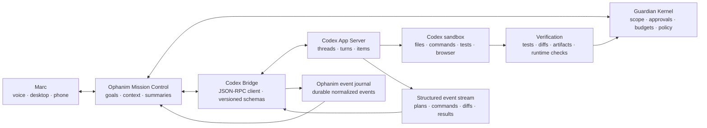

# Ophanim Codex Command Bridge

> **Implementation source of truth:** [Ophanim Master Implementation Plan](2026-08-15-ophanim-master-implementation-plan.md). This document is retained as Codex Bridge design rationale.

**Subtitle:** A personal mission-control layer for long-running work on Marc's PC  
**Status:** Architecture rationale; live execution is a later readiness milestone
**Date:** 2026-08-15  
**Companion plans:** [Cognitive Architecture Roadmap](2026-08-15-cognitive-architecture-roadmap.md) · [Guardian Loop](2026-08-15-guardian-loop-plan.md)

The system-level local-computer architecture is specified in
[Codex local-computer integration architecture](2026-08-15-codex-local-computer-architecture.md).

## Product decision

Ophanim should integrate with Codex as a supervised cognitive and execution
subsystem, behind a paired local resident and provider-neutral mission
contracts.

Ophanim owns:

- Personal context, goals, priorities, and continuity.
- Deciding when a coding or computer mission is worth proposing.
- Showing Marc what is happening in plain language.
- Guardian policies, authorization scope, interruption, and escalation.
- Connecting Codex results back to the wider personal world model.

Codex owns:

- Repository inspection and technical reasoning.
- File edits, commands, tests, browser checks, and other supported development work.
- Its own sandbox, execution policies, thread state, and approval protocol.
- Detailed technical work items and diffs.

The result is not “Ophanim secretly watches a terminal.” It is a deliberate control relationship:

> Marc gives Ophanim a mission → Ophanim starts or resumes a Codex thread → Codex streams observable work → Ophanim summarizes progress and routes decisions → Marc can steer, pause, approve, or stop → Guardian verifies the outcome.

## Why App Server is a provider, not the whole integration

The installed Codex CLI supports:

- `codex exec --json` for non-interactive jobs that stream JSON Lines events.
- `codex app-server` for a persistent bidirectional JSON-RPC connection.
- Thread start, resume, fork, read, list, and archive operations.
- Turn start, steer, interrupt, and completion notifications.
- Item events for agent messages, commands, file changes, plans, tools, and web activity.
- Aggregated diff updates.
- Command, file-change, network, permission, tool, and user-input approval requests.
- Generated TypeScript and JSON Schema bindings tied to the installed Codex version.

Use `codex exec --json` for isolated scheduled jobs. Use App Server for
interactive, observable, steerable missions when it is operationally ready.
Neither transport replaces the local resident, remote control session,
computer-use adapter, Guardian, or independent verification path.

Do not tail terminal escape sequences, scrape screen pixels, or parse prose written for humans when a structured protocol exists.

## Important limitation

Ophanim can reliably stream a Codex mission that Ophanim launched or resumed
through its bridge. It should not promise to attach invisibly to any arbitrary
Codex TUI already running in another terminal. Local computer use is a
separate typed adapter owned by the resident; it is not implemented by scraping
terminal output or granting a model an unrestricted shell.

Existing persisted Codex threads may be listed or resumed through supported thread APIs. Real-time supervision begins once the bridge owns the active App Server connection and subscription.

## Architecture

## Core components

### 1. Codex Supervisor

A backend service that:

- Detects the Codex executable and records its version and capabilities.
- Starts App Server over local stdio by default.
- Performs the required initialize handshake.
- Generates or validates version-matched protocol schemas.
- Restarts the bridge safely without losing persisted thread identities.
- Maintains a registry mapping Ophanim missions to Codex threads and turns.
- Never copies or exposes Codex authentication tokens.

Stdio should be the first transport. A localhost WebSocket may be considered later, but the official interface currently describes that transport as experimental. It must never be exposed on a non-loopback address without authentication and a deliberate threat review.

### 2. Event Normalizer

Convert Codex notifications into Ophanim's causal language:

| Codex signal | Ophanim record |
|---|---|
| Thread started/resumed | Mission session |
| Turn started/completed/failed | Mission phase |
| Plan update | Candidate or active plan revision |
| Command item | ActionAttempt |
| File change/diff | Proposed or completed artifact change |
| Tool/web/MCP item | External operation |
| Agent message | Milestone update or conclusion |
| Approval request | Authorization request |
| Usage | Mission resource record |
| Error | Exception and recovery situation |

Persist normalized events in the Guardian durable journal. Keep the original protocol payload in a restricted diagnostic store with retention controls.

### 3. Progress Interpreter

Ophanim should convert technical events into concise operator updates without claiming access to hidden private reasoning.

Good updates:

- “Codex mapped the RAG pipeline and is checking whether embeddings survive restart.”
- “It changed three files. Unit tests pass; the end-to-end retrieval test is still failing.”
- “Codex wants to install a dependency. The request is limited to the Ophanim workspace.”
- “No visible progress for eight minutes; the last command is still running.”
- “The implementation is complete, but verification found a regression in Windows startup.”

Bad updates:

- Raw chain-of-thought or claims about hidden internal reasoning.
- A firehose of every token or console byte.
- “Everything is fine” before tests or required verification finish.
- Rephrasing the same unchanged state every few seconds.

Update triggers:

- Plan created or materially revised.
- A new command or tool phase begins.
- Files change.
- Verification passes or fails.
- Codex requests permission or user input.
- A stall, retry loop, context compaction, or error occurs.
- A configurable time interval passes with meaningful new evidence.

### 4. Approval Broker

Map Codex requests into Guardian authorizations while preserving Codex's own approval mechanism.

Requirements:

- Show command, working directory, requested network target, file scope, and reason when provided.
- Support accept once, accept for session, decline, and cancel only where Codex offers them.
- Apply a stricter Guardian decision when Guardian and Codex policies differ.
- Never transform a denial into approval.
- Never run Codex with sandbox and approvals bypassed as a product default.
- Require direct Marc approval for credential access, system-wide writes, external publication, account changes, deployment, purchasing, deletion, or elevated execution.
- Record who approved what, for which thread/turn/item, and for how long.

### 5. Steering and Intervention

Mission Control should expose:

- **Steer:** append a correction to the active turn, such as “stop redesigning the UI; focus on the failing migration.”
- **Pause/interrupt:** stop the active turn safely.
- **Resume:** continue a persisted thread with context.
- **Fork:** explore a risky alternative without contaminating the primary thread.
- **Approve/decline:** answer Codex's scoped request.
- **Change mission:** create a new turn with revised success conditions.
- **Request checkpoint:** ask Codex to summarize current findings, changed files, remaining work, and blockers.

Ophanim may recommend an intervention. It should not silently steer a user-directed mission unless the original delegation explicitly authorizes autonomous steering within stated bounds.

### 6. Mission Ledger

Each mission persists:

- Human objective and why it matters.
- Workspace and allowed roots.
- Success conditions and required evidence.
- Codex thread and active turn identifiers.
- Autonomy level and approval policy.
- Budget: time, tokens/credits, command count, and external calls.
- Current plan and milestone.
- Files changed and commands executed.
- Approvals, denials, and interventions.
- Verification results.
- Final artifact and decision receipt.
- Episodic memory candidate and any learned procedure.

This ledger lets Marc ask: “What is Codex doing?”, “Why?”, “What changed?”, “What is it waiting for?”, “How much has it used?”, and “Can I stop it safely?”

## Control levels

| Level | Ophanim behavior |
|---|---|
| Observe | Display and summarize a Codex mission Marc started through Ophanim. No steering or approvals. |
| Navigate | Recommend steering and let Marc issue it. Route all approvals to Marc. |
| Supervise | Automatically steer on explicit conditions such as scope drift, repeated failure, or missed verification; Marc still approves side effects. |
| Delegate | Launch approved mission templates and handle pre-authorized workspace-local operations. Escalate exceptions. |
| Routine | Run a mature, replay-tested mission on a schedule and report only material outcomes or exceptions. |

Every new mission type starts at Observe or Navigate.

## Personal memory strategy

ChatGPT web memory and local Codex memory are separate systems. Ophanim must not assume that signing into Codex grants programmatic access to Marc's full ChatGPT history or memories.

Use three explicit sources:

### 1. Ophanim-owned relationship memory

Build from Marc's direct corrections, confirmed preferences, project decisions, routines, and approved summaries. This becomes the durable source used across engines.

### 2. Local Codex memory

Codex can maintain local memories under its own controls. Treat them as Codex context, not as Ophanim's authoritative personal profile. Ophanim should not edit generated Codex memory files directly.

### 3. Consented ChatGPT history import

If Marc wants the advantage of years of conversations, build an import workflow for a user-provided ChatGPT data export or selected conversations:

1. Inventory conversations locally.
2. Let Marc exclude categories, time ranges, people, and sensitive topics.
3. Extract candidate preferences, projects, values, recurring goals, expertise, and important decisions.
4. Attach conversation provenance and confidence.
5. Present candidates for review rather than silently accepting them.
6. Store accepted items in Ophanim relationship/semantic memory.
7. Support correction, expiration, export, and deletion.

Historical statements may be outdated or situational. They become evidence, not permanent truth.

## Advanced mission examples for Marc

These missions are grounded in the projects and interests visible in the current Ophanim workspace. They are larger than single-device checks and use Codex as an execution engine under Ophanim's persistent context.

## 1. Ophanim builds Ophanim

**Objective:** Turn the Cognitive Architecture roadmap into tested increments without Marc having to watch a terminal continuously.

Example loop:

1. Marc says, “Start Guardian Milestone 0. Keep current behavior compatible.”
2. Ophanim creates a mission with action-lifecycle invariants and required tests.
3. Codex maps current execution paths, implements the migration, and streams plans, diffs, commands, and test results.
4. Ophanim notices if Codex drifts into unrelated refactors and recommends steering.
5. Guardian routes dependency, network, or broad-write approvals to Marc.
6. A separate Codex review turn attacks the change for failure-state and restart bugs.
7. Ophanim verifies the agreed gate and creates an episode of what worked.

This is a guarded self-improvement flywheel—not unrestricted recursive self-modification.

## 2. Personal R&D laboratory

**Objective:** Convert an ambitious idea or research report into a working, benchmarked prototype.

Example:

- Ophanim extracts falsifiable claims from a paper.
- Codex builds a small experiment or simulator in an isolated branch/worktree.
- It runs baseline and candidate approaches, captures metrics, and generates charts.
- Ophanim compares results with Marc's larger goals and asks whether to continue, pivot, or archive.
- Successful experiments become design decisions and candidate skills.

This can drive world-model experiments, memory retrieval comparisons, local-model routing, energy measurements, or Guardian policy evaluation.

## 3. Multi-project mission control

**Objective:** Coordinate Ophanim, `nodalUI`, documentation, tests, and future prototypes as one portfolio.

Ophanim can:

- Maintain each project's current objective, health, and next decision.
- Detect duplicated implementations or incompatible schemas.
- Ask Codex to produce a cross-project impact analysis before a foundational change.
- Fork parallel solution attempts, compare verification evidence, and present the tradeoff to Marc.
- Keep “interesting prototype” work from silently replacing the flagship outcome.

The graph prototype could become the causal mission view while Ophanim remains the core product.

## 4. Digital chief of staff with an execution arm

**Objective:** Turn personal commitments into prepared artifacts and verified follow-through.

Example morning mission:

- Combine calendar, commute, tasks, active coding missions, important messages, and household exceptions.
- Identify the one decision most likely to block Marc's day.
- Resume the relevant Codex thread before Marc sits down.
- Prepare the failing-test diagnosis, design comparison, draft response, or document needed for that decision.
- Present a short briefing: what matters, what is ready, what needs Marc, and what can wait.

This is more valuable than reporting raw sensor state because it converts context into readiness.

## 5. Home reliability and digital-twin engineer

**Objective:** Treat the connected home as a maintained system rather than a collection of buttons.

Example:

- Ophanim detects recurring unavailable entities, latency spikes, automation conflicts, or suspicious camera gaps.
- Codex analyzes exported Home Assistant configuration and sanitized logs in a read-only sandbox.
- It constructs a reproducible failure timeline and proposes a patch.
- The patch runs against recorded events or a digital twin.
- Guardian requires Marc's approval before deployment or service restart.
- Ophanim verifies that the original failure no longer recurs.

The outcome is “the home remains dependable,” not “the living-room light is on.”

## 6. Personal knowledge compiler

**Objective:** Convert years of conversations, project notes, documents, and decisions into usable personal intelligence.

Ophanim and Codex can:

- Process a consented ChatGPT export locally.
- Build a timeline of projects, recurring interests, abandoned directions, and durable preferences.
- Detect contradictions and ask Marc which view is current.
- Create editable knowledge pages and relationship-memory candidates.
- Link claims back to their source conversations.
- Generate project-specific briefing packs for future Codex missions.

The goal is not maximum retention. It is accurate continuity under Marc's control.

## 7. Windows operations and recovery commander

**Objective:** Diagnose and repair local service failures with evidence and limited authority.

Example:

- Ophanim detects repeated server restarts, health-check failures, database growth, or log error patterns.
- Codex investigates source, configuration, recent changes, and runtime evidence.
- It reproduces the issue without mutating the live instance where possible.
- Ophanim reports the diagnosis and blast radius.
- Codex prepares the repair; Guardian separately approves elevated commands, service replacement, or restart.
- Ophanim monitors post-repair health and rolls back or escalates on regression.

## 8. Autonomous quality scientist

**Objective:** Continuously prove that Ophanim is becoming better, not merely larger.

Codex can:

- Mine failures and corrections from consented traces.
- Turn them into deterministic replay scenarios.
- Run local/cloud model, prompt, retrieval, and agent comparisons.
- Measure accuracy, latency, energy, cost, intervention burden, and safety violations.
- Bisect regressions and prepare the smallest repair.
- Publish a weekly scorecard explaining what improved and what remains untrusted.

## 9. Security steward

**Objective:** Maintain a living threat model for an increasingly capable personal agent.

Missions include:

- Review every new action type for authorization bypasses and data leakage.
- Scan diffs for taint, credential, sandbox, SSRF, and command-injection regressions.
- Exercise prompt-injection scenarios across browser, email, documents, images, and Home Assistant metadata.
- Verify that untrusted content cannot approve actions or expand Codex permissions.
- Maintain incident playbooks and generate evidence bundles when something is blocked.

## 10. Ambient project continuity

**Objective:** Let Marc leave the desk without losing control of long-running work.

Example updates:

- “Codex finished the schema migration and is running the full test suite. No decision needed.”
- “Two approaches passed. One is simpler; the other is 18% faster. I can have Codex benchmark memory use before you choose.”
- “Codex is blocked on a Windows service restart. Approve once, postpone, or stop the mission?”
- “The run has repeated the same failed repair twice. I paused it and preserved the diff.”

Marc can reply by voice or phone: “Choose the simpler version,” “show me the diff,” “fork the faster approach,” “stop,” or “wait until I am home.”

## First delivery milestones

## Milestone C0 — Read-only observer

- Start App Server over stdio.
- Initialize and generate version-matched schemas.
- Start/resume one Codex thread rooted in an allowed workspace.
- Normalize thread, turn, plan, command, file-change, diff, tool, usage, and error events.
- Render a Codex mission timeline in Operations.
- No steering and no approval responses.

**Gate:** Marc can watch a complete read-only Codex analysis and accurately understand its current phase, changes, result, and failure state.

## Milestone C1 — Human control

- Add steer, interrupt, resume, fork, and checkpoint actions.
- Route all Codex approval and user-input requests to Marc.
- Add desktop and configured-channel notifications for waiting decisions.
- Persist mission/thread mappings and causal events.

**Gate:** Marc can leave the desktop, receive a meaningful update, make a scoped decision, and safely stop or redirect the mission.

## Milestone C2 — Guardian supervision

- Add workspace, command, network, duration, token, and tool budgets.
- Detect repeated failure, unchanged progress, unexpected scope growth, and missing verification.
- Recommend or execute only explicitly authorized steering policies.
- Add decision receipts and post-run verification.

**Gate:** Guardian catches seeded scope-drift, repeat-loop, and unsafe-approval scenarios without blocking ordinary workspace-local work.

## Milestone C3 — Mission templates

- Add versioned templates for repository health, implementation, review, R&D experiment, Windows diagnosis, and regression repair.
- Define success evidence and approval policy per template.
- Integrate mission results with goals, episodes, and procedural-memory candidates.

**Gate:** A mature template can run repeatedly with predictable evidence, bounded permissions, and fewer unnecessary interventions.

## Milestone C4 — Personal mission portfolio

- Join calendar, commitments, project state, Codex missions, and Guardian situations.
- Rank proposed missions by impact, urgency, readiness, and cost.
- Generate a daily “what Ophanim can move forward for you” queue.
- Never start consequential work solely because the model finds it interesting.

**Gate:** The mission queue saves Marc time and advances confirmed goals without becoming an autonomous backlog generator.

## Security boundaries

- Default to App Server stdio on the same machine.
- Preserve Codex sandbox and approval settings.
- Use minimum workspace roots and never default to an entire drive or home directory.
- Keep `dangerously-bypass-approvals-and-sandbox` unavailable in normal product UI.
- Do not enable App Server's experimental external process-control API for the initial bridge.
- Treat Codex auth state and files under its home directory as credentials or sensitive generated state.
- Redact commands, diffs, and tool payloads before sending summaries over notification channels.
- Require reauthorization when a resumed mission's workspace, model, tools, or scope changes.
- Keep observer summaries distinct from authority: knowing what Codex is doing does not itself permit Ophanim to approve it.
- Store enough event detail for audit without turning the personal machine into an indefinite surveillance archive.

## First implementation issues

1. Add a `codex_bridge` package and version/capability discovery.
2. Generate and check in protocol fixtures for tests, while generating runtime bindings for the installed CLI version.
3. Implement a stdio JSON-RPC client with initialization, request correlation, cancellation, and bounded queues.
4. Add mission/thread/turn persistence and normalized Codex event records.
5. Map Codex items to Ophanim EventBus and the Guardian durable journal.
6. Build the read-only mission timeline in Operations.
7. Add progress summarization with dedupe and redaction.
8. Implement steer, interrupt, resume, fork, and checkpoint controls.
9. Implement the Approval Broker with direct-Marc decisions only.
10. Add budgets, stall/scope-drift policies, fault injection, and restart recovery.

## Definition of success

The Codex bridge succeeds when Marc can hand Ophanim a meaningful computer mission, walk away, and remain more in control than if he had stayed watching the terminal.

Ophanim should always be able to answer:

1. What is Codex trying to accomplish?
2. What is it doing now?
3. What evidence has it produced?
4. What changed on the computer?
5. Is it blocked, looping, drifting, or waiting for Marc?
6. What permission is being requested, and what is its exact scope?
7. How can Marc steer, pause, fork, or stop it?
8. Did the final result actually satisfy the mission?

That makes Codex Ophanim's first serious digital body—and makes Guardian Loop immediately useful for work far more consequential than checking a light.
