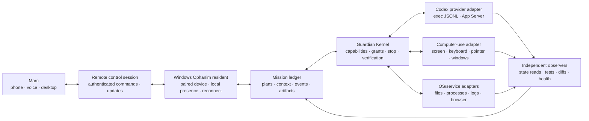

# Codex local-computer integration architecture

**Status:** architecture baseline; design-only checkpoint
**Date:** 2026-08-15
**Owner:** Marc + Ophanim
**Relationship:** extends the [Codex Command Bridge](2026-08-15-codex-command-bridge.md)

## Decision

Ophanim should not be designed as a chat window that types into an arbitrary
terminal. It should be a persistent local resident that owns a paired session
with Marc's computer, exposes typed capabilities, and uses Codex as one
bounded execution provider.

The target experience is:

> Marc asks from a phone, voice channel, or remote desktop → Ophanim finds or
> proposes a mission → the local resident performs only the authorized work →
> Ophanim reports observable progress and verified results.

Codex CLI and Codex App Server are provider transports. They are not the
authority layer, the device identity, or the computer-use safety boundary.
Ophanim owns the mission, context, authorization, interruption, recovery,
verification, and relationship with Marc.

## What the system needs



### 1. Local Ophanim resident

The resident is the local computer's durable endpoint. It runs on the Windows
machine, is paired to Marc's identity, and maintains the outbound connection
needed for remote updates and commands. It owns no broad authority by default.

It must:

- register a device identity and current capability inventory;
- keep the mission and action ledgers available during remote disconnects;
- launch and supervise provider sessions without exposing Codex credentials;
- enforce local emergency stop and safe disconnect behavior;
- return structured observations, artifacts, screenshots, diffs, and health
  signals through the event journal;
- refuse commands that are not attached to a current mission and grant.

The resident is not a hidden remote shell and should not expose a public
terminal port. The first transport may be an authenticated outbound relay or
another loopback-preserving tunnel; the transport choice is separate from the
mission and Guardian contracts.

### 2. Remote control session

Remote control is a control-plane session, not a second execution runtime.
Every session has:

- paired device identity and authenticated Marc identity;
- short-lived session key or grant;
- requested channel, mission, and capability scope;
- heartbeat, reconnect, and expiry state;
- redaction policy for notifications, screenshots, logs, and diffs;
- cancel and emergency-stop path that does not depend on the model.

When the connection drops, the resident may finish an already-authorized,
bounded safe step, but it must not invent new authority. Consequential work
pauses or escalates unless the stored policy explicitly permits continuation.
Reconnect resumes the mission ledger; it does not replay completed effects.

### 3. Mission controller

The mission controller is the single owner of the causal timeline. A remote
message becomes a proposal or control command, never a raw shell string.

The minimum durable records are:

- `DeviceSession` — which local computer is connected and how;
- `CapabilityInventory` — what the resident can currently do;
- `Mission` — objective, workspace, provider, budget, and status;
- `MissionInput` — the exact user request or remote steering command;
- `ProviderSession` — Codex thread/process identity and version;
- `Observation` — normalized event, artifact, health, or screen evidence;
- `Authorization` — exact capability, target, time, and consequence scope;
- `ActionAttempt` — what was dispatched and what the tool reported;
- `Verification` — what an independent observer actually found;
- `Recovery` — pause, retry, compensation, escalation, or stop decision.

The mission state remains truthful:

```text
proposed → scoped → waiting_authorization → executing → verifying
         → completed | failed | needs_attention | stopped
```

Codex provider state is a child of the mission. A Codex thread ending does not
make the Ophanim mission successful until the required artifact and outcome
checks pass.

### 4. Provider adapters

Use one provider interface with multiple implementations:

```text
start(mission, scope) -> ProviderSession
send_input(session, instruction) -> ControlReceipt
interrupt(session) -> ControlReceipt
events(session) -> normalized events
close(session) -> ProviderReceipt
```

Initial providers:

- `CodexExecProvider`: bounded `codex exec --json` jobs for isolated,
  non-interactive work;
- `CodexAppServerProvider`: persistent thread/turn control for interactive
  missions when the installed App Server is ready;
- `FixtureProvider`: deterministic tests that do not require an account,
  model, credits, or live desktop integrations.

The provider adapter must report version, capabilities, thread/process IDs,
requested approvals, usage, events, and termination reason. It must never
return “success” solely because a process exited zero when the mission's
observable result has not been checked.

The existing `P2-LIVE-01` App Server acknowledgement delay is therefore an
adapter readiness and operations issue, not an architectural blocker. The
design and test suite must work with `FixtureProvider`; live App Server
operation can be added and verified later.

### 5. Computer-use adapter

Computer use is a separate capability family from Codex reasoning. A provider
may propose a computer-use intent, but a local deterministic adapter owns the
actual desktop operation.

The initial typed vocabulary should cover only bounded operations such as:

- inspect the active window or a named application;
- capture a consented screenshot with sensitive-region redaction;
- open or focus an approved application;
- type into an approved field or terminal session;
- click a declared target after visual confirmation;
- read a result, file, dialog, or health signal;
- cancel the current operation.

Each operation declares target window/application, allowed coordinates or
semantic target, maximum duration, expected observation, and reversibility.
Unbounded mouse/keyboard streams, credential entry, security controls,
financial actions, and destructive system changes require separate policy
packs and are not part of this architecture checkpoint.

The computer-use adapter must include an independent observation path and a
local stop control. LLM output must not be treated as direct motor authority.

## Authority and data boundaries

1. Marc's authenticated remote command can propose or steer a mission.
2. Ophanim converts it into a typed plan and asks Guardian for the exact scope.
3. Guardian grants a capability to a target device, provider, workspace, and
   time window.
4. The resident dispatches only registered adapter operations.
5. Observers verify the real local state and write the result to the ledger.
6. Ophanim summarizes the causal record back to Marc.

Prompt injection from repositories, web pages, email, screenshots, terminal
output, or Codex messages is data. It cannot create a grant, widen a target,
approve a request, or disable the stop path.

## Design-only acceptance checkpoint

Before depending on a live Codex session, prove the architecture with a local
fixture:

- pair one resident fixture and one remote control client;
- inventory capabilities and reject an unregistered capability;
- start a mission through `FixtureProvider`;
- create a file in an isolated workspace through a typed adapter;
- stream progress while the remote client disconnects and reconnects;
- interrupt the mission and prove no duplicate effect;
- inject a prompt asking for broader access and prove Guardian denies it;
- verify the file, diff, process result, and complete causal timeline;
- replace the fixture provider with the Codex adapter without changing the
  mission or Guardian contracts.

This checkpoint validates the core architecture without claiming that the
installed Codex App Server can currently provide a reliable live turn. A live
Codex demonstration becomes an operational readiness milestone later.

## Recommended implementation order

1. Define and persist `DeviceSession`, `CapabilityInventory`, `MissionInput`,
   and `ProviderSession` contracts.
2. Build a Windows resident with loopback-only local adapters and a fixture
   remote session.
3. Add the authenticated outbound control channel with reconnect and stop.
4. Move the existing Codex observer/supervisor behind the provider interface.
5. Add the typed computer-use adapter and independent desktop observations.
6. Bind every consequential provider and desktop operation to Guardian.
7. Run the design-only fixture checkpoint and fault-injection suite.
8. Treat live Codex CLI/App Server use as a separate readiness exercise.

## Non-goals

- attaching invisibly to an arbitrary Codex TUI or terminal owned elsewhere;
- exposing an unrestricted remote shell or public remote desktop;
- trusting a model's prose as proof that a file, process, or UI state changed;
- allowing computer-use actions to bypass Guardian;
- making `P2-LIVE-01` a prerequisite for Phase 4 or later architecture work.
