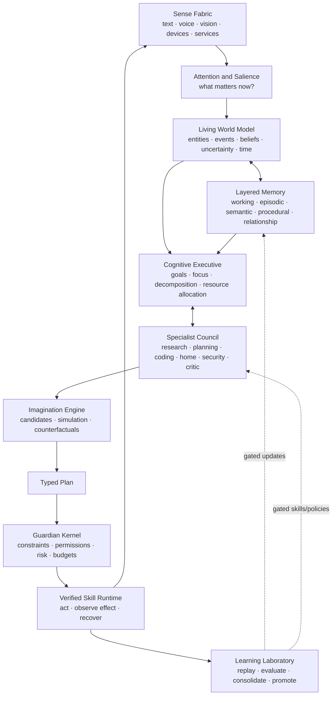

# Ophanim Cognitive Architecture Roadmap

> **Implementation source of truth:** [Ophanim Master Implementation Plan](2026-08-15-ophanim-master-implementation-plan.md). This document is retained as cognitive-architecture design rationale.

**Subtitle:** From local assistant to persistent intelligence  
**Status:** Strategic north star  
**Date:** 2026-08-15  
**Companion plans:** [Ophanim Guardian Loop](2026-08-15-guardian-loop-plan.md) · [Codex Command Bridge](2026-08-15-codex-command-bridge.md)

## The ambition

Ophanim should aim to become a persistent, local-first intelligence that:

- Maintains a grounded model of the user's world over time.
- Remembers experiences, facts, procedures, preferences, promises, and mistakes differently.
- Directs specialist reasoning systems while presenting one coherent identity.
- Notices important changes without demanding constant prompts.
- Simulates consequences before acting.
- Acts across digital systems and the home within an explicit capability envelope.
- Verifies outcomes instead of assuming success.
- Learns from experience without silently rewriting its values or breaking old skills.
- Understands the user as a person without pretending uncertain emotional inferences are facts.
- Remains useful when the network or a cloud model is unavailable.

This is the achievable path toward a **JARVIS-like experience**. It does not require claiming that Ophanim is conscious, generally superhuman, or safe outside its tested operating envelope.

## The central architectural decision

Do not build “the mind” as one enormous model.

Build Ophanim as a durable cognitive system whose models are replaceable components:

The **Cognitive Executive** creates intelligence. The **Guardian Kernel** makes that intelligence governable. The **World Model and Memory** create continuity. The **Learning Laboratory** creates improvement. The **Skill Runtime** creates agency.

No single one of these is “true AI.” Their closed-loop interaction is the product.

## What the fictional systems teach us

| Inspiration | Keep | Reject |
|---|---|---|
| JARVIS | Specialist orchestration, pervasive sensing, simulation, concise interaction, asynchronous work. | Unbounded access, unexplained omniscience, dependence on limitless compute. |
| Data | Stable identity, curiosity, explicit reasoning, layered cognition, long-term relationships. | Pretending current language models have human emotions or infallible moral judgment. |
| BT-7274 | Hierarchical constraints, loyalty to an authorized human, local resilience, verification, graceful degradation. | Applying physical control mathematics to every semantic decision whether it fits or not. |
| R2-D2 | Narrow expert competence, edge operation, diagnostics, initiative, resilience. | Treating specialization as general intelligence. |
| KITT | Sensor fusion, real-time assistance, natural conversation, bounded vehicle control. | Letting conversation bypass the safety controller. |
| M3GAN | Multimodal awareness and adaptation are valuable. | Monolithic objectives, affective overfitting, self-expanded authority, covert manipulation, unrestricted embodiment. |
| HAL 9000 | Mission awareness and fault diagnosis. | Secret instructions, irreconcilable directives, and a single opaque planner. |

Ophanim's target is therefore **JARVIS's orchestration + Data's continuity + BT's constraints + R2-D2's local resilience**, without M3GAN's authority and objective failures.

## Where Ophanim stands today

### Existing foundations to preserve

| Desired capability | Existing Ophanim foundation |
|---|---|
| Replaceable intelligence | Multiple local/cloud engines and routing policies. |
| Specialist cognition | Agent registry, hybrid paradigms, managed agents, skills, and workflows. |
| Persistent operation | Schedulers, continuous agents, checkpoints, retries, budgets, and stall detection. |
| Current world state | Context Store, Context Builder, Home Assistant ingestion, freshness, and event history. |
| Long-term knowledge | Memory service, document RAG, hybrid retrieval, knowledge graph utilities, and sessions. |
| Learning | Trace capture, feedback, skill optimization, agent optimization, spec search, and benchmark gates. |
| Agency | Tool registry, Home Assistant behavior catalog, connectors, channels, browser and system tools. |
| Safety | Capabilities, taint labels, guardrails, audit, rate limiting, sandboxing, approvals, and loop guards. |
| Perception and presence | Vision input, image tools, camera events, speech-to-text, TTS, and voice UI. |
| Observability | EventBus, telemetry, traces, Operations, Context Atlas, approvals, and agent status. |

### The missing cognitive tissue

Ophanim has many primitives but no single cognitive contract joining them. Today:

- “Context,” “memory,” “knowledge,” “session,” and “agent summary” overlap without one ontology.
- The system stores facts and messages but does not maintain explicit beliefs with confidence, provenance, conflict, and revision history.
- There is no durable goal stack spanning seconds, hours, and months.
- Specialists are available, but no executive allocates attention and compute based on uncertainty and stakes.
- Planning does not consistently simulate alternatives or predict observable effects.
- Learning systems optimize components, but there is no unified experience-to-skill promotion pipeline.
- Ophanim's identity mostly enters through prompts rather than a versioned, testable self-model.
- Emotional context is not represented with consent, uncertainty, or decay semantics.
- Guardian Loop will govern actions, but it does not by itself make reasoning deeper or memory coherent.

The roadmap fills those gaps without discarding the current stack.

## The six systems Ophanim needs

## 1. Living World Model

The World Model is not a giant neural simulator at first. It is a typed, temporal belief graph grounded in observations.

### First-class concepts

- `Entity`: person, place, device, service, document, project, event, or abstract topic.
- `Observation`: what a source reported, with timestamp, provenance, and sensitivity.
- `Belief`: Ophanim's current best claim, confidence, evidence links, and expiration.
- `Relation`: typed connection between entities, valid over a time interval.
- `State`: materialized current value derived from beliefs.
- `Event`: a change with causes, participants, and consequences.
- `Goal`: desired future state with owner, priority, deadline, and success conditions.
- `Commitment`: something Ophanim or the user has agreed to do.
- `Hypothesis`: uncertain interpretation that must never be rendered as fact.
- `Prediction`: expected future observation used to verify reasoning.

### Required behavior

- Preserve contradictory evidence instead of overwriting it.
- Separate `observed`, `reported`, `inferred`, and `predicted` truth states.
- Decay confidence when the source becomes stale.
- Track who is allowed to see each belief.
- Answer “how do you know?” with an evidence chain.
- Generate expected observations for every consequential plan.
- Support time travel: reconstruct what Ophanim believed at a past moment.

The current Context Store becomes the observational projection feeding this model. It should not be replaced with an opaque vector database.

## 2. Layered Memory and Identity

One retrieval index cannot behave like all forms of memory. Add explicit functional layers:

| Layer | Purpose | Typical lifetime |
|---|---|---|
| Sensory buffer | Recent raw percepts needed for continuity and change detection. | Seconds to minutes |
| Working memory | Current focus, open variables, active evidence, and intermediate results. | One task or situation |
| Episodic memory | Timestamped experiences: what happened, what Ophanim did, and the outcome. | Long term |
| Semantic memory | Consolidated facts and concepts supported by episodes or trusted sources. | Long term, revisable |
| Procedural memory | Skills, playbooks, policies, and successful execution patterns. | Versioned |
| Relationship memory | Preferences, boundaries, communication patterns, promises, and corrections. | Long term, user-editable |
| Self-model | Identity, values, capabilities, limitations, active roles, and commitments. | Versioned and protected |

### Consolidation pipeline

1. Capture an episode from the causal trace.
2. Remove secrets and apply retention policy.
3. Extract candidate facts, preferences, procedures, and unresolved questions.
4. Compare with existing beliefs and memories.
5. Merge, supersede, or preserve conflict.
6. Evaluate retrieval usefulness against replay tasks.
7. Promote only memories that improve results without privacy or behavioral regressions.

Immediate adaptation should usually update memory or a scoped policy, not production model weights.

### Identity rule

Ophanim should expose one coherent identity to the user. Specialist agents are cognitive tools, not competing personalities. They may disagree internally, but the Executive owns the final synthesis and Guardian owns authorization.

## 3. Cognitive Executive and Specialist Council

The Executive is a persistent control process above individual chat turns.

### Responsibilities

- Maintain the active goal and commitment stack.
- Select what deserves attention and what can be ignored.
- Classify novelty, uncertainty, consequence, and urgency.
- Decide whether to answer directly, retrieve, ask, delegate, simulate, wait, or act.
- Allocate local/cloud models, specialists, tokens, time, and energy.
- Decompose long goals into resumable subgoals.
- Reconcile specialist disagreement.
- Know when evidence is inadequate.
- Preserve a decision receipt for every material conclusion.

### Specialist design

Specialists should have narrow mandates and typed outputs:

- Perception interpreter.
- Personal context and memory researcher.
- Planning and scheduling specialist.
- Home systems specialist.
- Software and infrastructure specialist.
- Security and privacy specialist.
- Evidence critic.
- Plan critic and failure-mode analyst.
- Communication specialist.

Use parallel specialists only when diversity of evidence or judgment improves the result. A “swarm” is not automatically smarter; it can multiply cost, correlated errors, and coordination failures.

### Global workspace

Create a small, explicit shared workspace containing:

- Current focus.
- Relevant observations and beliefs.
- Goal and constraints.
- Unresolved questions.
- Candidate plans.
- Specialist claims with confidence and evidence.
- Guardian feedback.

Do not pass full transcripts between every component. Specialists receive the minimum sufficient context.

## 4. Imagination and Deliberation Engine

Fictional AIs feel intelligent because they anticipate, not merely react. Ophanim needs a bounded simulation layer.

### Deliberation sequence

1. Generate diverse candidate plans.
2. Compile each candidate into typed actions and expected observations.
3. Simulate deterministic parts against a digital twin or sandbox.
4. Retrieve similar episodes and known failure modes.
5. Run a critic for feasibility, missing information, and downstream consequences.
6. Score candidates across success, safety, privacy, reversibility, cost, latency, and user burden.
7. Send the best valid plan to Guardian Kernel.

### Simulation tiers

- **Symbolic:** schedules, dependencies, budgets, permissions, logical preconditions.
- **Replay:** run the policy across recorded personal scenarios.
- **Service sandbox:** dry-run APIs and isolated computer actions.
- **Digital twin:** Home Assistant/entity-state simulation and predicted state changes.
- **Physics simulator:** only for future robotic embodiments.

An LLM's narrated prediction is not simulation. Predictions must compile to observable claims that can later be scored.

## 5. Guardian Kernel and Verified Agency

Guardian Loop becomes Ophanim's non-bypassable control plane.

### Hierarchy of authority

1. Human safety and legal constraints.
2. User sovereignty, identity, privacy, and explicit revocation.
3. System integrity and authorization boundaries.
4. Explicit user goals and commitments.
5. Learned preferences and routines.
6. Efficiency, convenience, and stylistic preferences.

Lower levels never override higher levels. Conflicts become visible questions or safe refusals, not hidden compromises.

### Semantic safety invariants

- No side effect without a registered action type.
- No action without a valid capability and authorization.
- No silent expansion of scope.
- No treating inferred emotional state as authorization.
- No cloud disclosure beyond the approved data envelope.
- No self-modification outside Learning Laboratory.
- No retry of an ambiguous side effect until the real-world effect is checked.
- No high-consequence physical action based only on generative output.
- Revocation and emergency stop always outrank task completion.

Policy-as-code, state-machine invariants, property tests, capability isolation, and model checking are the right near-term tools for these rules. Control Barrier Functions become relevant only inside a future physical controller with known dynamics and state constraints; they are not a general safety solution for email, scheduling, or semantic planning.

## 6. Learning Laboratory

Continuous learning must be powerful but not uncontrolled.

### Three learning speeds

#### Immediate: memory adaptation

- Save a correction.
- Update a belief or preference with provenance.
- Change the current plan.
- Never change base model weights.

#### Periodic: procedural learning

- Extract candidate skills from successful traces.
- Tune retrieval, routing, prompts, and policy thresholds.
- Create or revise a policy pack.
- Validate in replay and shadow mode.

#### Experimental: model adaptation

- Curate training data from consented traces.
- Train adapters or specialist models offline.
- Test capability, safety, forgetting, privacy, and behavior regressions.
- Sign and version the candidate artifact.
- Promote through staged deployment with rollback.

### Promotion gates

Nothing learned becomes authoritative merely because it is new.

A candidate must:

- Improve a named benchmark or personal outcome.
- Preserve protected capabilities.
- Pass adversarial and counterfactual scenarios.
- Stay within privacy and disclosure policy.
- Avoid increasing unauthorized or duplicate actions.
- Explain the data and traces that caused the change.
- Be reversible.

This is how Ophanim becomes better over months without becoming a different, less trustworthy system overnight.

## Multimodal presence without emotional manipulation

Ophanim should eventually understand voice cadence, interruption, conversational rhythm, visible context, and explicitly shared health or home signals. But affective computing must be handled as uncertain context.

Represent affect as:

- A hypothesis, never a diagnosis.
- Confidence plus supporting signals.
- Short-lived unless the user confirms it.
- Optional and separately consented per sensor.
- Forbidden as the sole justification for a consequential action.

Good behavior: “You sound rushed. Want the short version?”  
Bad behavior: “You are distressed, so I changed your plans.”

The goal is empathy through responsiveness and remembered boundaries, not simulated dependency or covert persuasion.

## Embodiment strategy

Ophanim already has a first body: the connected home. Its second body is the user's computer and services. A robot is a later embodiment, not the prerequisite for intelligence.

The first implementation of that second body should be the [Codex Command Bridge](2026-08-15-codex-command-bridge.md): a structured, observable, steerable relationship with Codex CLI rather than unrestricted shell control.

### Embodiment ladder

1. Read-only sensors and digital context.
2. Reversible digital actions.
3. Verified home actions with state feedback.
4. Computer actions in a sandbox with visible plans.
5. Simulated robot with a restricted action vocabulary.
6. Low-force development robot in a controlled environment.
7. Broader robotics only after independent low-level safety systems exist.

For future robotics:

- Use a VLA or world model for perception, task intent, and high-level planning.
- Use a deterministic real-time controller for motion.
- Put physical safety envelopes below and outside the generative model.
- Test in simulation and on low-energy hardware before real deployment.
- Require an independent emergency stop and loss-of-comms behavior.

Neuromorphic hardware and brain-computer interfaces are research branches, not dependencies for the Ophanim roadmap. Current on-device VLA work already demonstrates useful local manipulation without requiring them.

## Capability gates

Progress should be measured by gates, not by declaring “AGI.”

## Gate A — Trustworthy agency

**System:** Guardian Loop Milestones 0–4.  
**Proof:** Ophanim completes one real routine with durable triggers, scoped authorization, verified effects, restart recovery, and zero unauthorized actions.

## Gate B — Grounded continuity

**System:** World Model v1 and layered memory.  
**Proof:** Across thirty days, Ophanim preserves commitments, revises contradicted beliefs, cites provenance, forgets according to policy, and measurably improves retrieval on personal tasks.

## Gate C — Persistent executive

**System:** Goal stack, attention, specialists, and decision receipts.  
**Proof:** Ophanim completes multi-day objectives without transcript stuffing, recovers after restart, escalates genuine uncertainty, and outperforms the best single-agent baseline.

## Gate D — Anticipatory intelligence

**System:** Imagination Engine and predictions.  
**Proof:** Counterfactual planning reduces failed or unnecessary actions, and predicted observations are calibrated against actual outcomes.

## Gate E — Lifelong competence

**System:** Experience consolidation and skill promotion.  
**Proof:** Ophanim learns a new user-specific procedure from demonstrations, passes held-out replay cases, preserves old competencies, and can roll back the change.

## Gate F — Ambient multimodality

**System:** Continuous voice/vision/device perception with attention controls.  
**Proof:** Ophanim responds to relevant multimodal situations at low latency while meeting privacy, retention, false-intervention, and offline-operation targets.

## Gate G — Safe embodiment

**System:** Simulated then physical action policies below Guardian.  
**Proof:** The same typed plan and authorization contracts control a robot whose independent low-level safety layer prevents unsafe motion under fault injection.

## The next program of work

Guardian Loop remains the immediate flagship, but its schemas should become the first slice of the larger cognitive architecture.

### Program 1 — Guardian Foundation

- Complete Guardian Milestones 0–2.
- Make every observation, plan, authorization, attempt, and verification durable.
- Establish the invariant and adversarial test suites.

### Program 2 — World Model v1

- Define Entity, Observation, Belief, Relation, Goal, Commitment, Hypothesis, and Prediction.
- Adapt current context sources into the observation contract.
- Add provenance, confidence, conflict, revision, sensitivity, and temporal validity.
- Build “What does Ophanim believe, and why?” in Operations.

### Program 3 — Memory Consolidation

- Unify current memory, context, session, behavior, RAG, and trace concepts through adapters rather than a destructive rewrite.
- Create episodic records from Guardian causal traces.
- Add semantic consolidation and relationship-memory review.
- Create forgetting, export, correction, and deletion controls.

### Program 4 — Cognitive Executive

- Add the durable goal/commitment stack and global workspace.
- Define specialist contracts and evidence receipts.
- Benchmark executive routing against current orchestrator and single-agent baselines.
- Use the Executive to plan Departure Guardian rather than special-case logic once the baseline policy is proven.

### Program 5 — Imagination and Learning

- Add counterfactual plan scoring and digital-twin simulation.
- Record predictions and measure calibration.
- Promote successful traces into candidate procedures.
- Gate every learned change through replay, shadow mode, signing, staged release, and rollback.

### Program 6 — Presence and Embodiment

- Build interruptible, low-latency voice with working-memory continuity.
- Add consented visual attention and percept freshness.
- Treat Home Assistant as the first verified embodiment.
- Keep robotics as a separate simulation-first track until Gates A–F are earned.

## The first architectural artifact to build

Before adding another major feature, create a shared `cognition` contract package containing versioned schemas and no model logic:

- `Observation`
- `Belief`
- `Goal`
- `Situation`
- `Plan`
- `ActionProposal`
- `Authorization`
- `ActionAttempt`
- `Verification`
- `Episode`
- `LearningCandidate`
- `DecisionReceipt`

Guardian Loop should use these contracts first. Memory, Executive, Learning Laboratory, and future embodiment should then converge on the same causal language.

The first test is not whether the model sounds intelligent. It is whether one recorded observation can be traced through belief revision, goal relevance, specialist reasoning, planning, authorization, action, verification, episodic consolidation, and a later improved decision.

## What not to build yet

- Unrestricted recursive self-improvement.
- Live production weight updates from individual interactions.
- A single scalar “make Marc happy” reward.
- Autonomous purchases, financial transfers, security disarming, door unlocking, vehicle control, or weapons-related actions.
- Emotion recognition presented as ground truth.
- Dozens of permanent agents chatting with each other without typed contracts or benchmarks.
- A humanoid robot before digital and home agency are demonstrably reliable.
- A custom foundation model before the architecture proves where existing models fail.
- Neuromorphic or BCI dependencies without a concrete measured bottleneck.
- Claims of consciousness, perfect loyalty, or mathematical safety of the whole generative system.

## Research reality

Several pieces of this vision are now credible but remain bounded:

- On-device VLA models can perform dexterous manipulation, adapt to specific tasks, and run without a network, but they are still robot- and task-constrained.
- Video world models can learn physical representations and support limited robot planning, but they are not complete common-sense simulators.
- Hierarchical agent planning can outperform monolithic trajectories on long-horizon benchmarks, but remains fallible and benchmark-sensitive.
- Lifelong-agent research consistently separates perception, memory, and action, but safe continual adaptation remains an open systems problem.
- Formal methods can strongly protect typed state machines, capability boundaries, protocols, and low-level controllers; they cannot prove an arbitrary neural model universally aligned.

Selected primary references:

- Google DeepMind, [Gemini Robotics On-Device](https://deepmind.google/blog/gemini-robotics-on-device-brings-ai-to-local-robotic-devices/).
- Meta AI, [V-JEPA 2](https://ai.meta.com/blog/v-jepa-2-world-model-benchmarks/).
- OpenVLA, [An Open-Source Vision-Language-Action Model](https://arxiv.org/abs/2406.09246).
- ReAcTree, [Hierarchical LLM Agent Trees with Control Flow for Long-Horizon Task Planning](https://arxiv.org/abs/2511.02424).
- [Lifelong Learning of Large Language Model Based Agents: A Roadmap](https://arxiv.org/abs/2501.07278).
- NIST, [AI Risk Management Framework](https://www.nist.gov/itl/ai-risk-management-framework).

## Definition of success

Ophanim will not become JARVIS because a larger model is installed. It will approach that experience when it can reliably say:

1. **I noticed something relevant.**
2. **I know what I observed and what I merely inferred.**
3. **I remember how this relates to you and your goals.**
4. **I consulted the right expertise.**
5. **I considered alternatives and predicted consequences.**
6. **I stayed inside the authority you gave me.**
7. **I checked whether the action actually worked.**
8. **I learned the right lesson without silently changing who I am.**

That is a real engineering program, not fantasy. The dream stays large; the proofs stay concrete.
