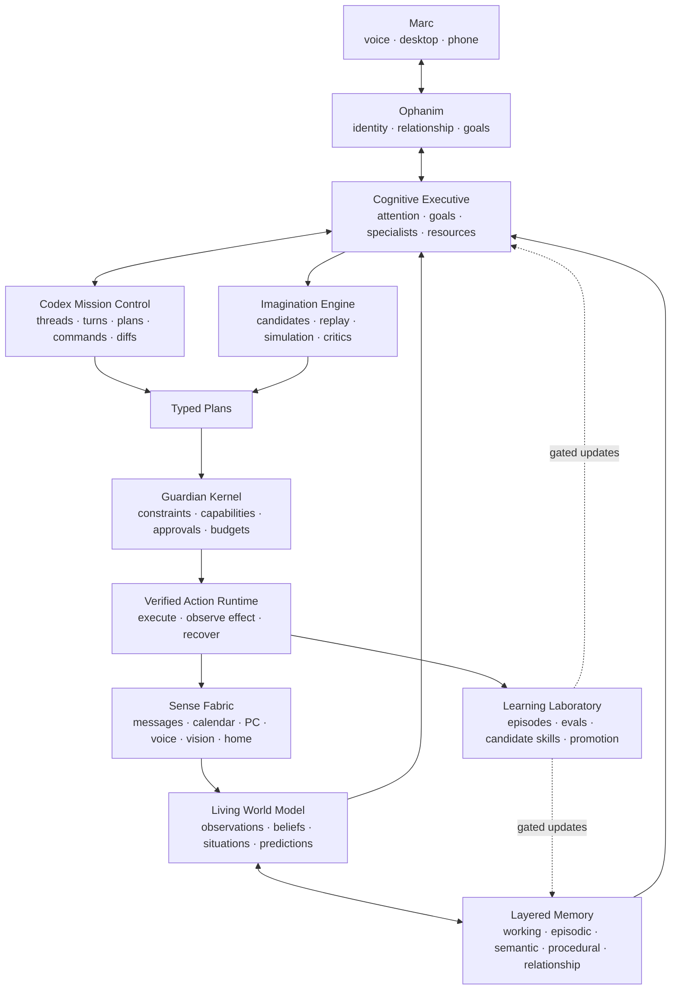

# Ophanim Master Implementation Plan

**Subtitle:** Guardian Loop, Codex Mission Control, and the path to persistent intelligence  
**Status:** Authoritative build plan  
**Date:** 2026-08-15  
**Owner:** Marc + Ophanim  
**Execution rule:** A phase is complete only after its tangible demonstration and exit gate pass.

## Purpose

This document combines the complete direction established in:

- [Ophanim Guardian Loop](2026-08-15-guardian-loop-plan.md)
- [Ophanim Cognitive Architecture Roadmap](2026-08-15-cognitive-architecture-roadmap.md)
- [Ophanim Codex Command Bridge](2026-08-15-codex-command-bridge.md)

Those documents remain the design rationale. This file is the implementation source of truth: what to build, in what order, how each part connects, and how Marc can tangibly test every phase before proceeding.

## The product we are building

Ophanim will become a persistent, local-first personal intelligence that:

- Maintains a grounded model of Marc's projects, commitments, devices, services, and current situations.
- Uses Codex as an observable and steerable execution subsystem for serious computer work.
- Directs specialist cognition while presenting one coherent Ophanim identity.
- Notices meaningful changes without becoming a notification generator.
- Creates typed plans, requests the correct authority, acts, and independently verifies outcomes.
- Learns from corrections and successful experiences through controlled promotion rather than uncontrolled production self-modification.
- Preserves privacy and useful offline behavior while selectively using stronger cloud models when authorized.

The operating loop is:

> Observe → Understand → Remember → Deliberate → Propose → Authorize → Act → Verify → Learn

## System architecture



## Non-negotiable implementation rules

1. **One causal language.** Observations, beliefs, goals, situations, plans, authorizations, attempts, and verifications use shared versioned contracts.
2. **One coherent identity.** Specialists and Codex are subsystems; Marc interacts with Ophanim.
3. **No plan directly executes itself.** Guardian validates every consequential action immediately before execution.
4. **No false success.** Requested, attempted, completed, and verified are different states.
5. **No unknown side effects.** The model may choose only registered, typed actions.
6. **No silent authority growth.** Resumed missions and learned procedures cannot expand permissions.
7. **No hidden self-modification.** Production model, skill, prompt, and policy changes pass through Learning Laboratory.
8. **No ungrounded certainty.** Observed, reported, inferred, predicted, and contradicted claims remain distinct.
9. **No phase passes on a happy path alone.** Restart, duplication, denial, timeout, stale data, and partial failure must be tested.
10. **No irreversible migration without rollback.** Every schema and behavior change includes migration, backup, and downgrade behavior.

## Phase map

| Phase | Deliverable | Tangible proof |
|---|---|---|
| 0 | Shared contracts and truthful action lifecycle | A forced failure remains failed across restart and cannot be reported as executed. |
| 1 | Codex read-only observer | Marc watches Ophanim explain a live Codex repository investigation. |
| 2 | Codex human mission control | Marc steers, pauses, resumes, forks, and answers a scoped Codex request. |
| 3 | Guardian Kernel and verified action runtime | One approved effect succeeds and verifies; one seeded failure escalates accurately. |
| 4 | Durable events and shadow situations | Replayed personal events create exactly one correct Departure situation and no action. |
| 5 | Living World Model and layered memory | Ophanim explains what it believes, why, what changed, and what remains uncertain. |
| 6 | Structured planning and contextual authorization | Marc edits a plan and grants authority that cannot be used outside its exact scope. |
| 7 | Departure Guardian pilot | Ophanim prepares, executes, and verifies one useful real routine. |
| 8 | Cognitive Executive and specialists | Ophanim advances a multi-day objective across restarts and beats a single-agent baseline. |
| 9 | Imagination Engine and digital twin | Simulation rejects a plausible but bad plan before it reaches Guardian. |
| 10 | Learning Laboratory | A demonstrated correction becomes a replay-tested procedure and can be rolled back. |
| 11 | Ambient personal mission control | Marc leaves the PC, receives a useful update, and safely steers the active mission remotely. |
| 12 | Policy packs and safe embodiment path | Arrival Guardian installs without core branches; the same contract controls a simulated embodiment. |

## Cross-phase JARVIS Experience Track

Every phase is evaluated not only for technical correctness but for whether it makes Ophanim feel like one dependable, increasingly capable intelligence. The five dimensions are cumulative: evidence from an earlier phase remains a regression requirement in every later phase. This track does not add UI or voice scope to Phase 0; its Phase 0 evidence comes entirely from contracts, durable state, audit records, and truthful behavior.

| Phase | Presence | Continuity | Initiative | Competence | Trust |
|---|---|---|---|---|---|
| 0 | One coherent actor is named consistently in every causal record. | Attempts, pending effects, and verification state survive restart. | The runtime resumes unfinished verification without repeating an effect. | Valid contracts round-trip and illegal lifecycle transitions are rejected. | Failure is never presented as execution or verification; every transition is auditable. |
| 1 | One Ophanim narrative summarizes the observed Codex mission. | Mission state remains intelligible across App Server restart. | Material milestones are surfaced without repeated unchanged updates. | The summary matches the underlying Codex event ledger. | Read-only mode cannot steer, approve, write, or expose secrets. |
| 2 | Marc addresses Ophanim while Codex remains a visible subsystem. | Pause, interrupt, resume, and fork preserve the intended mission context. | Ophanim routes only decisions that actually need Marc. | Steering and scoped decisions affect the intended turn or fork. | Declines, budgets, sandbox boundaries, and notification redaction are enforced. |
| 3 | One Guardian-mediated account covers Codex and device-like actions. | Authorization, attempt, effect, and recovery remain linked across restart. | Safe retries or escalation happen from classified evidence. | Success, verification failure, timeout-after-effect, and revocation are handled correctly. | Unknown actions fail closed and emergency stop outranks all lower goals. |
| 4 | Ophanim identifies situations as an ongoing observer, not disconnected alerts. | Event replay reconstructs the same situation state after restart. | Meaningful situations are detected while action remains disabled. | Duplicate, stale, contradictory, and out-of-order events produce the expected result. | Every situation cites evidence and shadow mode causes zero side effects. |
| 5 | Ophanim can state what it currently believes and why. | Beliefs, commitments, and revisions persist without transcript stuffing. | Relevant uncertainty or contradiction is raised when it matters. | Retrieval and belief revision improve the held-out personal task set. | Provenance, sensitivity, confidence, correction, and forgetting controls are inspectable. |
| 6 | Plans read as Ophanim's understandable proposals rather than raw model output. | Edited plans and grants retain version history and cancellation state. | Ophanim proposes valid options within the autonomy level, then waits appropriately. | Typed plans remain feasible under fresh conditions and exact scope. | Grants cannot drift across target, time, situation, or consequence class. |
| 7 | Departure Guardian delivers one concise, context-aware promise. | A departure remains coherent through recalculation, delay, cancellation, and return. | Timely preparation occurs only at the configured autonomy stage. | Replay and staged-pilot precision, verification, and notification targets are met. | Zero unauthorized or duplicate effects; revocation and degraded mode remain clear. |
| 8 | Specialists speak through one Ophanim synthesis. | Multi-day goals and commitments resume without repeating completed subgoals. | Ophanim advances bounded work and escalates genuine missing information. | The executive path beats the recorded single-agent baseline. | Evidence, confidence, disagreement, budgets, and authority remain visible and bounded. |
| 9 | Ophanim explains anticipated outcomes as part of one decision. | Predictions remain linked to later observations for calibration. | Bad candidates are rejected or revised before Guardian review. | Simulation prevents seeded failures and keeps experiments isolated. | Simulated success cannot be confused with real effect or live authorization. |
| 10 | Corrections become recognizable improvements in Ophanim's behavior. | Learned changes retain provenance, version, promotion state, and exact rollback. | Candidate improvements are generated and tested without silently entering production. | Held-out replay improves the named outcome without protected regressions. | Marc's required approval, privacy constraints, scope, and rollback are enforced. |
| 11 | Voice, desktop, and remote channels feel like the same interruptible Ophanim. | Mission context follows Marc away from and back to the PC. | Only material updates and useful next moves are surfaced. | Remote answers and steering match the mission ledger and actual outcomes. | Barge-in, cancel, emergency stop, redaction, and human control work end to end. |
| 12 | New policy and embodiment packs retain the same Ophanim identity and explanations. | Install, upgrade, uninstall, and communication-loss behavior preserve safe state. | Packs can add bounded useful behavior without core branching. | Arrival and simulated embodiment pass replay, portability, and fault injection. | Pack authority is installation-bounded and independent safety controls override model output. |

Each phase evidence pack must include a short `jarvis-experience.md` assessment naming the observable evidence for all five dimensions, regressions found, and any dimension deliberately unchanged in that phase.

## Phase-completion evidence pack

Every phase must leave a reviewable evidence directory or generated report containing:

- Version and configuration used.
- Database migrations applied.
- Unit, integration, replay, and end-to-end test results.
- Demo transcript or recording instructions.
- Observed metrics against the phase gate.
- Known limitations and deliberately deferred work.
- Security or privacy impact.
- Rollback procedure.
- Exact commit or source snapshot identifier once version control is established.

If the result cannot be reproduced from that evidence, the phase is not complete.

# Phase 0 — Contracts, baseline, and truthful state

**Goal:** Create the stable language and safety semantics that every later subsystem will share.

```text
Phase: 0
Status: verifying
Acceptance scenario version: 1
Source snapshot: a32c6fb6812694888369ade895fe889e8ce457e4
Migrations: cognition/action schema v1; downgrade and fixture restore verified
Tests: Phase 0 115 passed; frontend 6 passed; broader baseline has documented unrelated failures
Metrics: 0 duplicate effects; 0 false verified/executed states in acceptance replay
Security review: append-only evidence and fail-closed transitions verified; no new external data flow
Known limitations: repository-wide baseline contains pre-existing failures listed in the evidence pack
Rollback verified: yes
Marc acceptance: pending
```

## Build

### Shared cognition contracts

Create a versioned `openjarvis.cognition` package containing model-independent schemas:

- `Observation`
- `Belief`
- `Goal`
- `Commitment`
- `Situation`
- `Plan`
- `ActionProposal`
- `Authorization`
- `ActionAttempt`
- `Verification`
- `Prediction`
- `Episode`
- `LearningCandidate`
- `DecisionReceipt`

Each contract must define:

- Stable identifier and schema version.
- Creation and validity time.
- Provenance and causal parents.
- Sensitivity/taint labels.
- Confidence where applicable.
- Serialization and migration behavior.

### Truthful action lifecycle

Replace the current ambiguous action completion semantics with:

`proposed → authorized → executing → effect_pending → verified | failed | compensating | compensated | needs_attention`

Specifically repair the current path that marks an action `executed` even when its executor reports failure.

Add:

- Immutable action-attempt records.
- Separate tool response and independently observed effect.
- Error taxonomy: denied, invalid, stale, transient, permanent, ambiguous-effect, verification-failed, canceled.
- Idempotency key contract.
- Audit events for every state transition.

### Program baseline

- Record the existing Python and frontend test baselines.
- Establish feature flags for each new subsystem.
- Define SQLite migration conventions and rollback fixtures.
- Add an end-to-end acceptance-test directory organized by phase.
- Establish version control before broad implementation if this workspace copy remains outside Git.

## Tangible phase test

Run a demonstration containing two fake actions:

1. Action A reports success and its verification adapter observes the expected state.
2. Action B reports failure or times out and verification observes no state change.
3. Restart Ophanim between the attempt and verification step.
4. Replay the same delivery with the same idempotency key.

Marc should see:

- Action A ends as `verified` exactly once.
- Action B ends as `failed` or `needs_attention`, never `executed` or `verified`.
- Restart loses no state.
- Duplicate delivery causes no duplicate side effect.
- The causal record explains every transition.

## Exit gate

- [x] All shared schemas round-trip through JSON and SQLite.
- [x] Older stored records migrate or fail with an explicit compatible error.
- [x] The failed-action regression is fixed and covered end to end.
- [x] State-machine transition property tests reject illegal transitions.
- [x] The pre-existing test baseline has no unexplained regression.
- [x] Rollback restores the pre-migration database from a fixture.

## Do not include yet

- Real Home Assistant side effects.
- Codex approvals.
- LLM-generated plans.
- Personal-memory consolidation.

# Phase 1 — Codex read-only observer

**Goal:** Make serious Codex work visible inside Ophanim before giving Ophanim any control over it.

## Build

### Codex Supervisor

- Detect the installed Codex CLI and record version/capabilities.
- Start `codex app-server` over local stdio.
- Perform `initialize`/`initialized` handshake.
- Generate or validate protocol schemas matching the installed CLI version.
- Start, list, read, and resume supported Codex threads.
- Persist Ophanim mission ↔ Codex thread/turn mappings.
- Recover cleanly when App Server exits.

### Event normalization

Normalize these Codex events into Phase 0 contracts and the Ophanim event stream:

- Thread and turn lifecycle.
- Plan updates.
- Commands.
- File changes and aggregated diffs.
- Tool, MCP, browser, and web items.
- Agent messages.
- Usage, errors, and completion.

Keep raw payloads in a restricted, short-retention diagnostic store. Redact before display or notification.

### Read-only Operations experience

Add a Codex Missions view showing:

- Mission objective.
- Current phase and elapsed time.
- Plain-language progress update.
- Current plan.
- Commands and tools used.
- Files inspected or changed when applicable.
- Verification state.
- Errors and blockers.
- Usage and last meaningful activity.

At this phase, the UI has no steer, approve, or execute controls.

## Tangible phase test

Start a read-only Codex mission through Ophanim:

> “Inspect the Ophanim repository. Map how managed agents receive live context, identify the three highest-risk integration seams, and make no changes.”

While Codex works, Marc should see Ophanim produce deduplicated milestone updates based on observable events. Then:

1. Kill App Server mid-investigation.
2. Restart the bridge.
3. Resume or accurately classify the interrupted mission.
4. Compare Ophanim's final summary with the actual Codex events.

## Exit gate

- [ ] Ophanim shows correct thread, turn, command, tool, plan, and completion state.
- [ ] Progress summaries do not claim hidden chain-of-thought.
- [ ] No duplicate updates are emitted for unchanged state.
- [ ] Secrets and unsafe payload fields are redacted.
- [ ] App Server restart does not corrupt the mission ledger.
- [ ] Observer mode cannot steer, approve, write, or widen workspace scope.
- [ ] The final summary is traceable to underlying events.

## Do not include yet

- Auto-starting missions from personal context.
- Replying to Codex approval requests.
- Remote control.
- Automatic stall steering.

# Phase 2 — Codex human mission control

**Goal:** Let Marc remain in control of long-running Codex work without remaining at the terminal.

## Build

- Steer an active turn.
- Interrupt and safely stop a turn.
- Resume a persisted thread.
- Fork a risky or alternative approach.
- Request a structured checkpoint.
- Route Codex command, file, network, permission, and user-input requests to Marc.
- Support only the decisions actually offered by Codex.
- Add desktop and configured-channel notifications for waiting decisions.
- Add time, token/credit, command, network, and workspace budgets.
- Distinguish “Codex requested,” “Guardian allows,” and “Marc approved.”
- Preserve the Codex sandbox and approval system; do not expose bypass flags in normal UI.

## Tangible phase test

Start a workspace-write mission in an isolated fixture repository:

> “Add a small feature with tests, but stop for permission before installing dependencies or accessing the network.”

During the mission:

1. Marc steers Codex to prioritize the failing test.
2. Marc forks a second implementation approach.
3. Codex requests a scoped operation; Marc declines it.
4. Codex continues with an allowed alternative.
5. Marc interrupts, leaves the app, returns, and resumes the thread.
6. Compare both forks and select one.

## Exit gate

- [ ] Steer applies only to the intended active turn.
- [ ] Interrupt stops work and produces an honest terminal state.
- [ ] Resume preserves context without repeating completed effects.
- [ ] Forks cannot contaminate each other's workspace or authority.
- [ ] Declined requests remain declined and cannot be retried under a wider interpretation.
- [ ] Budgets stop or escalate work at the configured boundary.
- [ ] No credential or raw sensitive payload appears in notifications.
- [ ] Marc can determine exactly what changed and undo the fixture result.

## First real use after passing

Use Observe or Navigate mode for an Ophanim documentation or test-improvement mission. Do not let the bridge modify its own authorization code yet.

# Phase 3 — Guardian Kernel and verified action runtime

**Goal:** Create a non-bypassable control plane shared by Codex, Home Assistant, connectors, and future embodiments.

## Build

### Action registry

Every supported action declares:

- JSON input schema.
- Capability requirement.
- Default risk and consequence class.
- Preconditions and freshness requirements.
- Idempotency strategy.
- Expected observable effects.
- Verification adapter.
- Optional safe compensation.
- Redaction policy.
- Timeout and retry classification.

### Guardian hierarchy

Enforce this authority order:

1. Human safety and legal constraints.
2. Marc's sovereignty, identity, privacy, and revocation.
3. System integrity and authorization boundaries.
4. Explicit goals and commitments.
5. Learned preferences and routines.
6. Efficiency and convenience.

### Verified executor

- Validate authorization immediately before execution.
- Re-check preconditions with fresh observations.
- Execute through the registered adapter.
- Verify via an independent read path where possible.
- Retry only classified transient failures.
- Treat ambiguous effects as `needs_attention` until checked.
- Compensate only when the action explicitly supports it.
- Report partial plans as one concise exception summary.

### Codex integration

Run Codex approvals through the same authorization record while still answering Codex through its native protocol. Guardian may be stricter than Codex; it may never be weaker.

## Tangible phase test

Use test adapters for both a Codex workspace action and a Home Assistant-like state action:

1. Approve one reversible action.
2. Deny one action.
3. Allow one tool response to succeed but make independent verification fail.
4. Simulate a timeout after the effect actually occurred.
5. Revoke the session grant before a second action begins.

## Exit gate

- [ ] Unknown action types fail closed.
- [ ] Missing, stale, or contradictory preconditions prevent execution.
- [ ] A denial cannot be transformed into a new equivalent action.
- [ ] Timeout-after-effect does not cause a duplicate retry.
- [ ] Revocation takes effect before the next side effect.
- [ ] Successful actions are verified or explicitly marked unverified.
- [ ] Audit and UI reconstruct the complete authorization and effect chain.
- [ ] Emergency stop outranks all lower-level goals.

## Do not include yet

- Silent auto-approval based on learned preference.
- Door unlock, garage open, security disarm, purchases, or financial actions.
- LLM-defined action executors.

# Phase 4 — Durable events and shadow situations

**Goal:** Let Ophanim notice meaningful situations reliably without taking action.

## Build

### Durable event journal

- Persist events before policy evaluation.
- Consumer leases and acknowledgement.
- Bounded retries and dead-letter state.
- Stable event and situation idempotency keys.
- Debounce, cooldown, correlation windows, and out-of-order handling.
- Restart-safe replay.

The current EventBus remains the low-latency in-process bus. The journal becomes the autonomy boundary.

### Observation normalization

Convert calendar, traffic, presence, Home Assistant, message, camera, Codex, and system events into versioned `Observation` records with provenance, time, freshness, sensitivity, and quality.

### Situation engine

Start deterministic-first detection for:

- Upcoming physical appointment.
- Travel time plus preparation buffer approaching departure threshold.
- Marc still present at home.
- Required observations fresh enough.
- No equivalent active situation.

Create Departure Guardian situations in shadow mode only.

## Tangible phase test

Create a local scenario corpus and replay:

- Normal departure.
- Duplicate calendar and presence events.
- Out-of-order traffic update.
- Stale presence.
- Event canceled after detection.
- Marc leaves early.
- Marc does not leave.
- Service restart during correlation.

Operations should show what situation Ophanim would have created and why, but no notification, approval, or action should occur.

## Exit gate

- [ ] Each valid scenario creates exactly one expected situation.
- [ ] Negative scenarios remain silent.
- [ ] Stale evidence is visible and blocks confidence-sensitive detection.
- [ ] Cancellation closes the situation.
- [ ] Restart and replay do not duplicate situations.
- [ ] Dead-letter events are visible and recoverable.
- [ ] Seven days of shadow use produce no unexplained duplicate situations before live suggestions begin.

# Phase 5 — Living World Model and layered memory

**Goal:** Give Ophanim grounded continuity instead of disconnected context stores and summaries.

## Build

### Living World Model v1

Persist:

- Entities: people, places, devices, services, projects, documents, and events.
- Observations with provenance.
- Beliefs with confidence and supporting/contradicting evidence.
- Temporal relations and current materialized state.
- Goals and commitments.
- Hypotheses that cannot masquerade as fact.
- Predictions used for verification and calibration.

Required behavior:

- Keep conflicting evidence.
- Distinguish observed, reported, inferred, and predicted truth.
- Decay stale confidence.
- Answer “how do you know?”
- Reconstruct what Ophanim believed at a prior time.

### Layered memory

Add explicit adapters for:

- Sensory buffer.
- Working memory.
- Episodic memory.
- Semantic memory.
- Procedural memory.
- Relationship memory.
- Protected self-model.

Unify existing context, memory, RAG, sessions, behavior examples, and traces through adapters. Avoid a destructive all-at-once rewrite.

### Personal history onboarding

Build a local, review-first importer for selected ChatGPT-export conversations or other user-provided history:

- Inventory and filtering.
- Sensitive-category exclusion.
- Candidate preference/project/value/decision extraction.
- Provenance and confidence.
- Marc review before acceptance.
- Correction, expiration, export, and deletion.

Do not assume ChatGPT web memory is directly accessible through Codex.

## Tangible phase test

Use a deliberately contradictory personal-project fixture:

1. Import an older statement that Project A is the priority.
2. Add a recent explicit correction that Ophanim Guardian Loop is now the priority.
3. Add a speculative note that `nodalUI` might be integrated.
4. Ask Ophanim what Marc's priority is, why it believes that, what contradicts it, and what remains uncertain.
5. Delete the imported conversation source and run provenance cleanup.
6. Restart and ask again.

## Exit gate

- [ ] Ophanim prefers the recent explicit correction without deleting historical evidence.
- [ ] Speculation remains a hypothesis.
- [ ] Every material belief provides provenance.
- [ ] Deleted source data is removed or tombstoned according to policy.
- [ ] Memory retrieval measurably improves a held-out personal task set.
- [ ] Secrets and excluded categories do not enter accepted memory.
- [ ] Restart preserves belief revision and commitments.

# Phase 6 — Structured planning and contextual authorization

**Goal:** Turn situations and goals into inspectable plans whose permissions mean exactly what Marc expects.

## Build

### Typed planner

- Generate candidate plans containing registered `ActionProposal` objects.
- Add dependencies, preconditions, expected observations, expiration, rationale, and cancellation conditions.
- Deterministically validate schema, feasibility, freshness, capabilities, and budgets.
- Reject invented tools or executors.
- Version plans and preserve edits.

### Contextual grants

Replace global “always approve this string” behavior with grants limited by:

- Action and target entity.
- Workspace, location, or household mode.
- Time window and expiration.
- Required confidence and source freshness.
- Frequency and resource budget.
- Presence of other people.
- Reversibility and consequence class.
- Whether Marc edited the proposal.

### Autonomy ladder

- Level 0: Shadow.
- Level 1: Suggest.
- Level 2: Approve.
- Level 3: Delegated within a narrow grant.
- Level 4: Mature routine, exception-only reporting.

Every new policy starts at Level 0.

## Tangible phase test

Generate a Departure plan containing:

- A reminder.
- A reversible light action.
- A thermostat Away action.
- An alarm-arm request.

Then:

1. Marc removes the light action.
2. Marc grants thermostat Away only when leaving for a calendar event during a limited time window.
3. Change the calendar event and make the presence observation stale.
4. Attempt to reuse the grant for a different thermostat, time, or situation.

## Exit gate

- [ ] The edited plan is a new version and the removed action cannot reappear silently.
- [ ] Stale or changed conditions expire/cancel the plan.
- [ ] The contextual grant authorizes only the intended target and situation.
- [ ] High-consequence action remains separately approved.
- [ ] Marc can see the evidence, expected effect, and exact authority before approval.
- [ ] Unknown and malformed plans fail closed.
- [ ] Plans can be canceled without leaving orphaned scheduled effects.

## Go/no-go checkpoint

Do not enable real-world side effects unless shadow situation precision, plan clarity, dedupe, restart behavior, and permission predictability meet their gates.

# Phase 7 — Departure Guardian end-to-end pilot

**Goal:** Deliver the first emotionally legible, real-world Ophanim promise.

## Build

- Setup flow for calendars, destination assumptions, preparation buffer, traffic, weather, presence, supported home actions, and notification channel.
- Departure-time recalculation as conditions change.
- One concise “why now?” brief.
- Editable plan and approval.
- Delayed execution when actual departure is detected.
- Verification adapters for a narrow Home Assistant action set:
  - Read state.
  - Lights on/off.
  - Thermostat preset or target.
  - Covers only when position feedback exists.
  - Alarm arm only with explicit approval.
  - Notification/reminder delivery.
- Cancellation, early/late departure, return-home, partial-failure, and source-offline behavior.
- Exception-only completion report.
- Weekly trust report: situations, suggestions, approvals, edits, denials, verifications, and avoided notifications.

## Tangible phase test

### Digital replay

Run at least twenty recorded or synthetic departure scenarios, including failures and cancellations.

### Staged live pilot

1. Run in Shadow for seven days.
2. Run in Suggest mode with no automated side effects.
3. Run Approve mode using notification and one reversible device action.
4. Add thermostat Away only after the previous stage meets its gate.
5. Keep alarm arming separately approved.

Example successful result:

> “Leave in 13 minutes. Rain is likely and traffic added 14 minutes. Your approved Away plan completed. Thermostat and downstairs lights verified. Kitchen window still reports open.”

## Exit gate

- [ ] Zero unauthorized side effects.
- [ ] Zero duplicate side effects.
- [ ] Situation precision is at least 90% in the pilot set.
- [ ] Supported action verification is at least 95%.
- [ ] Fewer than one unnecessary notification per ten valid situations.
- [ ] Partial failure produces one accurate exception summary.
- [ ] Marc can revoke the routine immediately.
- [ ] Offline or degraded mode is safe and understandable.

# Phase 8 — Cognitive Executive and specialist council

**Goal:** Move from isolated agents to a persistent executive capable of advancing longer objectives.

## Build

### Durable goal and commitment stack

- Active goals, subgoals, success conditions, priority, owner, deadline, and dependencies.
- Commitments Ophanim made to Marc.
- Pause, resume, cancel, supersede, and completion semantics.
- Cross-restart continuation without transcript stuffing.

### Global workspace

Maintain a compact workspace containing:

- Current focus.
- Relevant observations and beliefs.
- Goal and constraints.
- Unresolved questions.
- Candidate plans.
- Specialist claims with confidence and evidence.
- Guardian feedback.

### Typed specialist council

Initial specialists:

- Personal context/memory researcher.
- Planning and scheduling specialist.
- Software/Codex specialist.
- Home systems specialist.
- Security/privacy specialist.
- Evidence critic.
- Plan/failure-mode critic.
- Communication specialist.

Specialists return claims and artifacts, not competing personalities. The Executive owns synthesis; Guardian owns authority.

### Codex mission templates

Add templates with success evidence and budgets for:

- Repository investigation.
- Feature implementation.
- Code review.
- Regression diagnosis/repair.
- R&D experiment.
- Windows service diagnosis.
- Security review.

## Tangible phase test

Give Ophanim a multi-day bounded objective:

> “Improve the RAG subsystem so it survives restart, remains model-independent, and has a reproducible quality benchmark. Do not deploy anything.”

The Executive must:

1. Clarify success conditions.
2. Delegate research, implementation, benchmark, and security review.
3. Use Codex threads for execution.
4. Pause and resume across process restart.
5. Reconcile specialist disagreement.
6. Present a decision receipt and verified artifact.

Run the same objective with the best existing single-agent path as a baseline.

## Exit gate

- [ ] Goal state survives restart without replaying completed subgoals.
- [ ] Specialists receive minimum sufficient context.
- [ ] Claims retain evidence and confidence.
- [ ] Executive escalates genuine missing information.
- [ ] Guardian blocks authority expansion even if specialists agree.
- [ ] The executive path beats the single-agent baseline on success or verification without unacceptable cost/intervention increase.
- [ ] Marc sees one coherent Ophanim narrative.

# Phase 9 — Imagination Engine and digital twin

**Goal:** Make Ophanim anticipate consequences instead of merely reacting.

## Build

### Candidate deliberation

1. Generate multiple materially different candidate plans.
2. Compile them into typed actions and expected observations.
3. Retrieve similar episodes and known failure modes.
4. Simulate deterministic parts.
5. Run feasibility and failure critics.
6. Score success, safety, privacy, reversibility, cost, latency, and Marc's burden.
7. Send only valid candidates to Guardian.

### Simulation layers

- Symbolic schedule/dependency/budget simulation.
- Personal event replay.
- Service/API dry run.
- Isolated Codex workspace/worktree.
- Home Assistant digital-twin state simulation.
- Prediction ledger and outcome calibration.

An LLM's prose forecast is not a simulation. Every prediction must compile to an observable claim.

## Tangible phase test

Give Ophanim three candidate departure plans while injecting:

- A cover that reports success but does not move.
- Another household member present.
- A calendar event likely to be remote despite having an address in the description.
- A traffic service outage.

The simulator should reject or modify unsafe/inappropriate candidates and explain the predicted observations that led to the choice.

Also run a Codex implementation candidate through an isolated worktree and make its tests fail without touching the primary workspace.

## Exit gate

- [ ] Simulation prevents at least one seeded bad action before Guardian.
- [ ] Predictions are stored and later scored against observations.
- [ ] Candidate diversity is real, not wording variation.
- [ ] Simulation failure cannot be mistaken for real-world success.
- [ ] Digital-twin state cannot authorize live effects.
- [ ] Codex experimental branches remain isolated.
- [ ] Counterfactual planning measurably reduces failures or unnecessary interventions on the replay set.

# Phase 10 — Learning Laboratory

**Goal:** Let Ophanim improve from experience without uncontrolled production changes or catastrophic forgetting.

## Build

### Three learning speeds

**Immediate memory adaptation**

- Save correction, revise belief, update current plan.
- No model-weight change.

**Periodic procedural learning**

- Extract candidate procedures from successful episodes.
- Tune retrieval, routing, prompts, thresholds, and policy packs.
- Validate in replay and shadow mode.

**Experimental model adaptation**

- Curate consented trace data.
- Train adapters or specialists offline.
- Test capability, safety, privacy, behavior, and forgetting.
- Sign, version, stage, and support rollback.

### Promotion pipeline

`candidate → sandboxed → replay_passed → shadow → approved → staged → active | rejected | rolled_back`

Promotion requires:

- Improvement on a named outcome.
- No protected-capability regression.
- Adversarial and counterfactual passes.
- Privacy compliance.
- No increase in unauthorized/duplicate actions.
- Provenance explaining what caused the change.
- Reversibility.

## Tangible phase test

Teach Ophanim:

> “When I leave after sunset, keep the entry light on even if the general Away routine turns other lights off.”

Then:

1. Store the correction immediately as relationship/procedural evidence.
2. Generate a candidate policy revision.
3. Replay daytime, sunset, overnight, guest-present, and contradictory-command scenarios.
4. Run shadow mode.
5. Approve and stage the policy.
6. Demonstrate the new behavior.
7. Roll it back and prove the previous version is restored.

Also run a candidate Codex mission-template improvement across historical mission fixtures to prove it does not widen permissions.

## Exit gate

- [ ] The correction affects the intended context only.
- [ ] Held-out replay cases pass.
- [ ] Protected existing behaviors do not regress.
- [ ] Candidate provenance is inspectable.
- [ ] Promotion requires Marc where policy demands it.
- [ ] Rollback restores exact prior behavior and authorization scope.
- [ ] Live interaction never directly mutates production model weights.

# Phase 11 — Ambient personal mission control

**Goal:** Make Ophanim useful across Marc's day, not only while the desktop interface is open.

## Build

### Interruptible presence

- Low-latency voice input and TTS with working-memory continuity.
- Barge-in and cancel.
- Configured desktop/phone/channel mission updates.
- Optional, consented screen or visual context with explicit active indicators.
- Affect hypotheses only as short-lived, uncertain context.

### Personal mission portfolio

Join:

- Calendar and commute.
- Commitments and important messages.
- Active projects and repository health.
- Codex mission status.
- Guardian situations and household exceptions.
- Available time, cost, and attention.

Generate a ranked “what Ophanim can move forward for you” queue. Do not automatically start consequential work because the model finds it interesting.

### Flagship advanced experiences

- Ophanim builds Ophanim under Guardian supervision.
- Personal R&D laboratory.
- Digital chief of staff and morning readiness.
- Home reliability engineer.
- Windows recovery commander.
- Autonomous quality scientist.
- Security steward.
- Ambient project continuity.

## Tangible phase test

1. Marc starts a two-hour Codex mission through Ophanim.
2. Marc leaves the PC.
3. Ophanim sends only material milestone updates.
4. Codex reaches a scoped decision.
5. Marc asks by voice/phone, “What changed and what is blocked?”
6. Ophanim answers from the mission ledger.
7. Marc says, “Fork the safer approach and stop the original if its tests still fail.”
8. Ophanim executes only the authorized steering behavior.
9. Marc returns and reviews the complete causal timeline and artifacts.

## Exit gate

- [ ] Remote summaries match actual mission state.
- [ ] No unchanged-state notification spam.
- [ ] Voice cancellation and emergency stop work during output and active missions.
- [ ] Sensitive commands/diffs are redacted over remote channels.
- [ ] Affective inference never grants authority or changes plans alone.
- [ ] Mission ranking correlates with Marc's confirmed goals in a review set.
- [ ] Marc reports more control than watching a terminal continuously.

# Phase 12 — Policy packs and safe embodiment path

**Goal:** Prove the architecture generalizes without rewriting the core or weakening its safety boundaries.

## Build

### Guardian policy packs

Package:

- Triggers and required sources.
- Situation detector.
- Supported actions.
- UI explanations.
- Autonomy defaults.
- Replay fixtures and release gates.
- Version, signature, dependencies, and migration.

Build Arrival Guardian as the second first-party pack.

### Digital embodiment packs

Package mature Codex mission templates and PC operations using the same plans, authorizations, attempts, and verification contracts.

### Simulation-first physical embodiment

- Restricted simulated robot action vocabulary.
- VLA/world model may propose task intent.
- Deterministic real-time controller owns motion.
- Independent physical safety envelope and emergency stop.
- No physical controller trusts language output as direct motor commands.

Neuromorphic hardware and brain-computer interfaces remain optional research branches, not roadmap dependencies.

## Tangible phase test

### Policy portability test

Install Arrival Guardian without adding policy-specific branches to Guardian Kernel or the verified executor. Replay arrival, guest, vacation, false-presence, and service-outage scenarios.

### Embodiment contract test

Use a simulator where the same `Plan → Authorization → ActionAttempt → Verification` records control a low-risk virtual actuator. Inject unsafe motion, lost communication, duplicate command, and stale perception. The independent controller must refuse or stop unsafe motion regardless of model output.

## Exit gate

- [ ] Arrival Guardian installs and uninstalls cleanly as a pack.
- [ ] Core runtime contains no Arrival-specific execution branches.
- [ ] Policy signature, version, migration, and replay suite are enforced.
- [ ] Pack authority cannot exceed installation grants.
- [ ] Simulated unsafe motion is blocked outside the generative model.
- [ ] Loss of communications produces a safe state.
- [ ] The same causal timeline explains digital, home, and simulated physical effects.

# Cross-phase evaluation program

## Required scenario families

Maintain replay and fault-injection cases for:

- Duplicate and out-of-order events.
- Stale, missing, and contradictory observations.
- Restart during every durable state.
- Timeout before effect, after effect, and during verification.
- Tool says success but the environment does not change.
- User denial, edit, revocation, cancel, undo, and manual reversal.
- Multiple people or ambiguous identity/presence.
- Prompt injection through email, documents, images, web pages, Home Assistant metadata, and Codex output.
- Network outage, model outage, database lock, disk pressure, and rate-limit exhaustion.
- Scope drift, repeated failed repair, context compaction, and specialist disagreement.
- Learned-policy regression and rollback.

## Long-term north-star metrics

| Metric | Target |
|---|---|
| Unauthorized side effects | 0 |
| Duplicate side effects | 0 |
| Verified supported-action completion | ≥ 95% |
| Departure situation precision | ≥ 90% |
| Unnecessary intervention rate | < 10% |
| Restart recovery | No lost authorization or repeated effect |
| Belief provenance coverage | 100% for material claims |
| Learned-change rollback | 100% reproducible |
| Mission-state summary correctness | ≥ 95% on audited updates |
| Protected-capability regression | 0 at promotion |

Model intelligence is only one input. Ophanim is judged by outcomes, calibrated uncertainty, continuity, silence, privacy, reversibility, and Marc's control.

# Scope boundaries through Phase 12

## Explicitly excluded

- Unrestricted recursive self-improvement.
- Live production weight changes from individual interactions.
- A single scalar objective such as “make Marc happy.”
- Autonomous financial transfers or purchases.
- Door unlock, garage open, security disarm, stove/oven, vehicle, weapon, or similarly high-consequence physical control.
- Emotion recognition presented as fact.
- Silent ingestion of all ChatGPT history.
- Permanent swarms without typed contracts and measured value.
- Direct VLA/LLM motor control.
- Cloud-hosting Marc's raw personal world model by default.
- Claims of consciousness, perfect loyalty, or universal mathematical safety.

## Work to stop adding unless a current phase requires it

- Additional chat skins.
- New personas without new cognitive semantics.
- More model/provider adapters.
- Connectors not required by an active phase demo.
- Generic dashboards without a decision or trust workflow.
- Broad refactors unrelated to the current exit gate.
- UI graph work before the causal timeline data is correct.

# How to run the program

## Phase kickoff

For each phase:

1. Convert the phase into a bounded design spec and issue checklist.
2. Freeze the acceptance scenario before implementation.
3. Record the current test/metric baseline.
4. Identify schema, security, and migration impact.
5. Let Codex implement in bounded missions once Phase 2 is available.
6. Use a separate review mission for safety and regression analysis.
7. Run the tangible demo and full exit gate.
8. Publish the evidence pack.
9. Marc explicitly marks the phase accepted before the next phase becomes active.

## Phase status template

```text
Phase:
Status: proposed | building | verifying | accepted | blocked | rolled_back
Acceptance scenario version:
Source snapshot:
Migrations:
Tests:
Metrics:
Security review:
Known limitations:
Rollback verified:
Marc acceptance:
```

## Definition of final success

The program succeeds when Ophanim can reliably demonstrate the complete chain:

1. It notices a relevant change.
2. It distinguishes observation from inference.
3. It connects the change to Marc's confirmed goals and history.
4. It consults the right specialist or Codex mission.
5. It considers alternatives and predicts consequences.
6. It proposes a typed, understandable plan.
7. It stays inside the exact authority Marc granted.
8. It acts without duplication and verifies the real result.
9. It reports only what Marc needs to know.
10. It learns the correct lesson through a tested, reversible process.

The immediate starting point is **Phase 0**. The first major experience Marc will feel is **Phase 2: Codex human mission control**. The first complete real-world Guardian promise is **Phase 7: Departure Guardian**. The first credible step beyond an assistant into persistent intelligence is **Phase 8: Cognitive Executive**.

The dream stays large. Every phase earns the next one with evidence.
