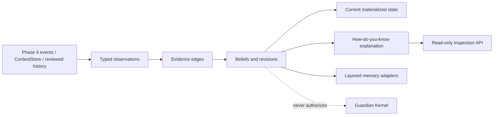

# Phase 5 — Living World Model and layered memory

Status: **accepted by Marc on 2026-08-16 (America/New_York); deterministic
implementation slice complete.** Real-world validation remains deferred.

Date: 2026-08-15

## Decision

Phase 5 adds an additive, provider-neutral world model instead of replacing
the existing context store, JSONL fact memory, RAG/knowledge store, sessions,
behavior examples, traces, or Phase 4 journal. The new SQLite database is
opt-in with `OPHANIM_PHASE_5_ENABLED=1` and `OPHANIM_PHASE5_DB=...`.

The world model is a continuity and explanation layer. It is not a planner,
permission system, action executor, Guardian grant store, or live personal-data
connector.

## Smallest complete slice

### Typed world records

The package stores:

- entities: people, places, devices, services, projects, documents, events;
- source records and deletion state;
- observations with information kind (`observed`, `reported`, `inferred`,
  `predicted`), claim class (`fact`, `hypothesis`, `prediction`), source
  provenance, confidence, observed time, evidence text, sensitivity, and taint;
- beliefs keyed by entity, predicate, value, and claim class;
- supporting and contradicting evidence edges;
- append-only materialized belief revisions and current-state rows;
- goals, commitments, and predictions with verification state;
- memory items with explicit layer, source, evidence IDs, confidence, and
  expiration.

Every accepted belief has at least one supporting observation and therefore a
source ID, observation ID, and provenance record. A correction adds evidence,
marks the older competing fact contradicted, and leaves the older row and
revision available for explanation and historical reconstruction.

The current fact winner is deterministic: hypotheses and predictions cannot
win a fact slot; active fact claims are ranked by decayed confidence, then
updated time, then stable ID. Confidence uses a 180-day half-life in v1. A
stale belief remains inspectable and gains an uncertainty explanation rather
than disappearing silently.

### Layered memory adapters

`LayeredMemory` exposes explicit adapters for the sensory buffer, working,
episodic, semantic, procedural, relationship, and protected self-model layers.
All ordinary adapters write typed `MemoryItem` rows. The protected self-model
rejects writes without an explicit trusted internal call; imported text cannot
populate it.

The adapters are the compatibility seam for existing context, memory, RAG,
session, behavior-example, and trace systems. Phase 5 only projects selected
typed inputs through that seam now. A future migration may add more adapters
without requiring an all-at-once rewrite.

`ExistingSourceAdapters` provides the non-destructive projections for those
existing families: typed context/Phase 4 events, facts, retrieval results,
session messages, behavior examples, and traces. It copies source labels and
selected typed metadata into the appropriate layer while leaving the original
store authoritative for its existing callers.

### Review-first personal-history importer

`PersonalHistoryImporter` accepts local, user-provided deterministic fixtures.
It inventories conversations, applies category and content exclusions, and
extracts only a small explicit grammar for priorities, preferences, values,
decisions, and hypotheses. Extraction creates `pending` candidates. Only an
explicit review acceptance creates an observation and semantic-memory item.

Sensitive categories and secret-like text are excluded before raw text is
stored. Source deletion clears stored conversation text, tombstones its
observations and memory items, deletes pending/accepted candidates from active
review, and recomputes beliefs while retaining the deletion marker. Direct
corrections may remain from a different source, so deleting an older source
does not erase unrelated current evidence.

Conversation text is untrusted data. Prompt-injection wording is not parsed as
authority, a Guardian grant, an action, an executor request, or a protected
self-model write. The importer has no dependency on those components.

## Why each new abstraction exists

| Abstraction | Problem solved now | Future-only capacity |
|---|---|---|
| `WorldModelStore` | Durable typed records, source cleanup, restart, replay | Cross-database migration or distributed storage |
| Observation/evidence graph | Explainable conflict instead of silent overwrite | Learned evidence weighting |
| Belief revisions/current state | Fast current answers plus historical reconstruction | Multi-user/world branches |
| `LayeredMemory` adapters | One explicit seam over existing memory families | Automatic consolidation and learned retrieval routing |
| `ExistingSourceAdapters` | Practical projections without a destructive migration | Full cross-store deduplication and backfill |
| `PersonalHistoryImporter` | Consented local onboarding with review and deletion | Live export connectors or LLM extraction |
| `/v1/world` API | Read-only inspection of beliefs, evidence, sources, and revisions | Rich frontend drill-down and conversational explanation |

## Upstream and authority boundaries

- Phase 4 `DurableEvent` records can be projected through a narrow typed event
  mapping; arbitrary payload text remains tainted evidence.
- Existing `ContextEvent` state can be projected without changing
  `ContextStore` ownership.
- Existing memory/RAG/session/trace implementations remain in place and are
  not rewritten by this phase.
- The world model writes no Guardian tables, creates no authorization, and
  exposes no executor or connector call.
- Phase 6 structured planning and contextual authorization are explicitly
  deferred.

## Tangible fixture test

The deterministic acceptance corpus:

1. imports an older `Project A is the priority` statement;
2. imports and accepts a newer `Ophanim Guardian Loop is now the priority`
   correction;
3. imports and accepts `nodalUI might be integrated` as a hypothesis;
4. answers current priority, supporting evidence, contradiction, provenance,
   and uncertainty questions;
5. deletes the old conversation source and runs provenance cleanup;
6. closes and reopens SQLite;
7. asks the same questions again.

Expected behavior is deterministic preference for the current correction,
retention of historical evidence while its source is active, non-factual
hypothesis handling, source tombstoning, and restart durability.

## Deliberate non-scope

- direct ChatGPT web-memory access;
- live external history/connectors;
- LLM extraction or semantic embeddings in the importer;
- Phase 6 planning, contextual authorization, or autonomous action;
- live Codex App Server work, computer-use execution, or new Guardian policy;
- acceptance of this phase without Marc's explicit review.

## Rollback

1. Set `OPHANIM_PHASE_5_ENABLED=0` and restart the server.
2. Preserve the configured Phase 5 SQLite file if its evidence is needed.
3. To remove only Phase 5 state, stop callers, make a backup, and remove only
   the explicitly configured `OPHANIM_PHASE5_DB` file; restore the backup to
   replay it later.
4. Existing Phase 0–4, Guardian, Codex, context, RAG, session, and trace stores
   are independent and are not removed by this rollback.
