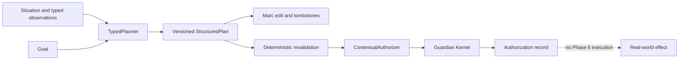

# Phase 6 — Structured planning and contextual authorization

Status: **accepted by Marc on 2026-08-16 (America/New_York)** for the
deterministic local slice; Phase 7-boundary follow-up remains deferred.

Date: 2026-08-16

Acceptance record: Marc explicitly accepted Phase 6 in the Codex task on
2026-08-16 (America/New_York). Deferred follow-up is live source validation
and real-world execution, which remain Phase 7 concerns and do not expand this
acceptance.

Phase 5 remains pending Marc's review and explicit acceptance. Phase 6 does
not change that status and does not reopen Phase 2, Phase 3, Phase 4, or Phase
5 work.

## Decision

Phase 6 adds a separate `openjarvis.planning` package. It does not replace the
small compatibility `cognition.Plan` contract and it does not add an
execution path. The package turns a typed situation/context into a durable,
reviewable plan whose steps contain registered `ActionProposal` objects. A
`Phase6Controller` validates the plan and contextual grant, then calls the
existing Guardian Kernel for final authorization. The controller intentionally
has no execute method.

## Data model

### Planning context

`PlanningContext` contains the exact situation ID/type, workspace, location,
household mode, calendar event ID/start, presence set, context confidence,
and named `ObservationSnapshot` records. Each observation carries a source ID,
observed time, confidence, satisfaction, and typed details. Observation text
is not parsed as policy or authority.

### Plan and step

`StructuredPlan` is identified by `(plan_id, version)` and contains:

- goal and situation identity;
- creation and expiration time;
- rationale and evidence/source IDs;
- a context snapshot and deterministic fingerprint;
- a resource budget;
- ordered typed `PlanStep` records;
- status and cancellation reason;
- removed-step tombstones and whether Marc edited the version.

Each `PlanStep` contains exactly one `ActionProposal`, its registered executor
name, registered capability, consequence class, reversibility, dependencies,
preconditions, expected observations, expiration, rationale, cancellation
conditions, and resource cost. An unknown action, invented executor, malformed
parameters, schema mismatch, missing evidence, stale evidence, failed
precondition, dependency cycle, consequence mismatch, invalid reversibility
claim, or budget overrun makes validation fail closed.

### Contextual grant

`ContextualGrant` is an exact scope record. It names all of the following:

- action type and target entity;
- workspace, location, household mode, and exact presence set;
- situation ID/type and exact calendar event ID/start;
- plan ID, plan version, and step ID;
- start/end window and expiration;
- minimum confidence and maximum source age;
- required observation keys;
- frequency and resource budgets;
- reversibility, consequence class, and Marc-edit flag.

The grant is not a string approval. It has no wildcard fields in the Phase 6
authorization path. Missing source observations, stale sources, changed
calendar context, changed situation, changed presence, wrong target, wrong
time, wrong plan version, changed consequence class, changed edit state,
revocation, or expiration all deny.

## Lifecycle

1. `TypedPlanner.generate` accepts typed steps and persists version 1 only if
   deterministic validation succeeds.
2. Marc edits are append-only version transitions. Removing a step creates a
   new version and a persistent tombstone. A tombstoned step cannot be inserted
   into any later version.
3. `TypedPlanner.revalidate` checks the persisted plan after restart, edit,
   changed situation, stale observations, or changed calendar context. Invalid
   current plans become `invalid` or `expired`; scheduled effects are canceled.
4. Marc may create a contextual grant only when it exactly matches the plan
   step and evidence scope. New action policies default to Level 0.
5. Authorization checks plan status, validation, autonomy level, high-
   consequence approval, grant scope, freshness, and budgets. A successful
   Phase 6 decision creates a short-lived exact Guardian grant and invokes
   `GuardianKernel.authorize`.
6. Authorization decisions, denials, grant use, edits, status changes, and
   scheduled-effect cancellation are persisted for inspection.
7. Cancellation marks scheduled/pending effects canceled. There is no Phase 6
   worker that can execute them, and no orphan remains schedulable.

Restart/replay uses unique plan versions, edit IDs, grant IDs, action
idempotency keys, and `(grant_id, action_id)` usage keys. A previously allowed
decision is returned rather than creating a second Guardian authorization.

## Autonomy ladder

| Level | Meaning in Phase 6 |
|---|---|
| 0 | Shadow only; no authorization |
| 1 | Suggest only; no authorization |
| 2 | Marc must explicitly approve the step |
| 3 | Delegated only inside an exact contextual grant |
| 4 | Mature routine, still bounded by an exact grant in this slice |

No policy row means Level 0. Level 4 is represented as a policy value and
remains deliberately conservative until the later maturity gates are met.
High/critical/security consequence classes and every non-reversible step
remain separately approved even if a contextual grant exists. Alarm arming is
therefore not bundled into thermostat delegation.

## Guardian boundary

The planning package has no connector, executor, notification, calendar, or
smart-home dependency. It uses the existing `ActionRegistry` for allow-list
validation and the existing `GuardianKernel` for the final authorization
record. It does not call `GuardianKernel.execute`, and a plan cannot create a
real-world effect by itself. The derived Guardian grant is scoped to the
exact registered action, target, parameters hash, session, and short expiry;
the Phase 6 controller is the only path that combines it with contextual
scope.

Untrusted imported text and prompt-shaped descriptions remain ordinary
metadata. They cannot register an action, select an executor, create a grant,
raise autonomy, approve a plan, or cross the Guardian boundary.

## Inspection surface

When `OPHANIM_PHASE_6_ENABLED=1`, the local API exposes:

- `POST /v1/planning/plans` — validate and persist a typed plan;
- `GET /v1/planning/plans/{id}` and `/versions` — inspect versions, edits,
  grants, validation, audit, and scheduled effects;
- `POST /v1/planning/plans/{id}/edits` — record a Marc removal edit;
- `POST /v1/planning/plans/{id}/revalidate` and `/cancel`;
- `POST/GET /v1/planning/grants` and grant revocation;
- `POST /v1/planning/plans/{id}/authorize` — inspectable authorization only;
- `POST /v1/planning/policies/{action_type}` — set an explicit autonomy level.

Every response reports `side_effects: false` for this slice. The feature is
disabled by default and uses the local `OPHANIM_PHASE6_DB` when enabled.

## Known limitations

- Planning input is typed and deterministic; there is no LLM plan generation
  or live source adapter.
- The local API currently exposes removal edits, not a general visual plan
  editor.
- Scheduled-effect records are cancellation bookkeeping only; Phase 7's
  delayed execution and verification pilot is intentionally absent.
- Live calendar, presence, thermostat, alarm, messaging, and notification
  services are not connected.
- Phase 5, Phase 4 operational validation, and Phase 5 personal-data review
  remain later checkpoints.

## Review status and Phase 7 boundary

The deterministic implementation, focused tests, API inspection checks,
formatting, and local evidence are complete for this slice. Marc accepted
Phase 6 on 2026-08-16 (America/New_York). Phase 5 remains pending Marc's
review and acceptance.

Phase 7 is intentionally not enabled. No departure pilot, live connector,
delayed effect, notification, device verification, or autonomous side effect
was added.
